<h1 align="center">🏛️ CourtSight</h1>
<p align="center" markdown=1>
  <i>AI-Powered Legal Intelligence Platform for Supreme Court Decisions</i>
</p>

<p align="center">
  <a href="">
      
  </a>
  <a href="https://fastapi.tiangolo.com">
      
  </a>
  <a href="https://docs.pydantic.dev/2.4/">
      
  </a>
  <a href="https://www.postgresql.org">
      
  </a>
  <a href="https://github.com/pgvector/pgvector">
      
  </a>
  <a href="https://redis.io">
      
  </a>
  <a href="https://docs.docker.com/compose/">
      
  </a>
  <a href="https://ai.google.dev">
      
  </a>
  <a href="https://python.langchain.com">
      
  </a>
  <a href="https://nginx.org">
      
  </a>
</p>

---

## 🎯 About CourtSight

**CourtSight** is a revolutionary AI-powered legal intelligence platform designed to democratize access to legal information in Southeast Asia. The platform transforms complex Supreme Court decision documents into searchable and understandable insights, making justice more transparent and inclusive.

### 🌟 Vision & Mission

**Vision:** Democratize access to legal information through AI technology to create more transparent and inclusive justice.

**Mission:** Develop an AI platform that enables semantic search, intelligent analysis, and voice assistance for Supreme Court decisions, helping legal professionals, researchers, and the general public understand legal complexities.

### 🚀 Key Features

1. **🔍 AI-Powered Search Engine**
   - Semantic search of Supreme Court decisions using natural language
   - Vector database with pgvector for similarity search
   - Automatic analysis and summarization using LLMs
   - **Multi-strategy retrieval** (vector, hybrid, parent-child)
   - **RAGAS evaluation framework** for search quality assessment
   - Legal citation validation and references


2. **🤖 AI Legal Chatbot** *(Active Development)*
   - **Conversational AI** with advanced context awareness
   - **LangGraph-powered workflow orchestration** for complex legal reasoning
   - **Streaming responses** for real-time interaction
   - **Enhanced memory system** with conversation isolation
   - **RAG-enhanced responses** with legal document context
   - Integration with Supreme Court decision database


3. **🎙️ AI Voice Assistant** *(Future Development)*
   - Real-time transcription for lawyer note-taking
   - Conversation analysis and key point extraction
   - Voice commands for legal document search
   - Integration with legal knowledge base


---

## 🏗️ System Architecture

### 📊 Tech Stack Overview

| Category            | Technology                      | Purpose                                         |
| ------------------- | ------------------------------- | ----------------------------------------------- |
| **Backend API**     | FastAPI + SQLAlchemy 2.0       | RESTful API with async support                  |
| **Database**        | PostgreSQL + pgvector          | Relational data + Vector similarity search      |
| **AI/ML Services**  | Google AI + LangChain          | Text vectorization + Natural language processing |
| **Search Engine**   | Multi-strategy RAG             | Optimized similarity search with HNSW indexing  |
| **Task Processing** | Document Processor + Scheduler | Automated document ingestion pipeline           |
| **Authentication**  | JWT + FastCRUD Admin           | Secure API access with admin panel             |
| **Caching**         | Redis + Client-side Cache      | High-performance caching layer                  |
| **Production**      | Nginx + Docker + SSL           | Production-ready deployment with security       |

### 🏗️ Layered Architecture Visualization


#### 🔄 Layer Dependencies & Data Flow
- **Presentation** → **Service** → **Repository** → **Domain**
- Each layer depends only on the layer below it
- Cross-layer dependencies are handled through interfaces
- Domain layer has no external dependencies

#### ✅ Architecture Benefits
- **Separation of Concerns**: Each layer has distinct responsibilities
- **Testability**: Easy to unit test individual layers
- **Maintainability**: Changes in one layer don't affect others
- **Scalability**: Can scale individual components independently
- **Flexibility**: Easy to swap implementations without affecting business logic

### 🏛️ System Architecture Diagram

```mermaid
graph TB
    subgraph "Client Layer"
        WEB[🌐 Web Frontend<br/>Next.js]
        API_CLIENT[📱 API Client<br/>Mobile/Desktop]
    end
    
    subgraph "API Gateway Layer"
        GATEWAY[🚪 API Gateway<br/>FastAPI Router]
        AUTH[🔐 Authentication<br/>JWT Middleware]
        RATE[⏱️ Rate Limiter<br/>Redis]
    end
    
    subgraph "Business Logic Layer"
        SEARCH[🔍 Search Orchestrator<br/>Semantic Search]
        PROCESSOR[📄 Document Processor<br/>Bulk Ingestion]
        LLM[🤖 LLM Services<br/>AI Analysis]
    end
    
    subgraph "Data Layer"
        VECTOR_DB[🧮 Vector Database<br/>pgvector]
        DOC_STORE[📚 Document Store<br/>PostgreSQL]
        EMBED[🔤 Embedding Service<br/>Text → Vector]
        CACHE[⚡ Cache Layer<br/>Redis]
    end
    
    subgraph "Future Services"
        CHATBOT[💬 Chatbot AI<br/>Q&A Hukum<br/>Coming Soon]
        VOICE[🎤 Voice Assistant<br/>Audio Analysis<br/>Coming Soon]
        RAG[🧠 RAG Pipeline<br/>Context Retrieval<br/>Coming Soon]
    end
    
    %% Client connections
    WEB --> GATEWAY
    API_CLIENT --> GATEWAY
    
    %% Gateway processing
    GATEWAY --> AUTH
    AUTH --> RATE
    RATE --> SEARCH
    RATE --> PROCESSOR
    RATE --> LLM
    
    %% Business logic to data
    SEARCH --> VECTOR_DB
    SEARCH --> DOC_STORE
    SEARCH --> EMBED
    PROCESSOR --> DOC_STORE
    PROCESSOR --> EMBED
    LLM --> VECTOR_DB
    LLM --> CACHE
    
    %% Data layer connections
    VECTOR_DB -.-> DOC_STORE
    EMBED --> VECTOR_DB
    
    %% Future connections (dotted)
    CHATBOT -.-> SEARCH
    VOICE -.-> LLM
    RAG -.-> VECTOR_DB
    
    %% Styling
    classDef clientLayer fill:#e3f2fd
    classDef gatewayLayer fill:#f3e5f5
    classDef businessLayer fill:#e8f5e8
    classDef dataLayer fill:#fff3e0
    classDef futureLayer fill:#fafafa,stroke-dasharray: 5 5
    
    class WEB,API_CLIENT clientLayer
    class GATEWAY,AUTH,RATE gatewayLayer
    class SEARCH,PROCESSOR,LLM businessLayer
    class VECTOR_DB,DOC_STORE,EMBED,CACHE dataLayer
    class CHATBOT,VOICE,RAG futureLayer
```



### 🔍 Component Details

#### **Presentation Layer (API Gateway)**
- **FastAPI Routes**: RESTful endpoints for legal document operations
- **Request Validation**: Pydantic schemas for input validation
- **Response Serialization**: Consistent JSON response formatting
- **Authentication Middleware**: JWT token validation
- **Rate Limiting**: Redis-based request throttling

#### **Service Layer (Business Logic)**
- **Search Orchestrator**: Coordinates semantic search operations
- **Document Processor**: Handles bulk document ingestion and processing
- **LLM Services**: Manages AI-powered analysis and summarization
- **Workflow Orchestration**: Manages complex business processes
- **Transaction Management**: Ensures data consistency

#### **Repository Layer (Data Access)**
- **CRUD Operations**: Database interaction through FastCRUD
- **Vector Search**: pgvector similarity queries
- **External APIs**: Integration with Mahkamah Agung website
- **Cache Management**: Redis-based caching strategies

#### **Domain Layer (Core Models)**
- **Legal Document Models**: SQLAlchemy ORM models
- **Business Rules**: Domain-specific validation logic
- **Data Schemas**: Pydantic models for type safety
- **Value Objects**: Immutable domain concepts


### 📈 Scalability & Performance

#### **Horizontal Scaling Points**
- **API Instances**: Multiple FastAPI containers behind load balancer
- **Worker Processes**: Distributed document processing with ARQ
- **Database Read Replicas**: PostgreSQL streaming replication
- **Cache Sharding**: Redis cluster for distributed caching

#### **Performance Optimizations**
- **Vector Indexing**: HNSW indexes for fast similarity search
- **Query Optimization**: Prepared statements and connection pooling
- **Async Processing**: Non-blocking I/O throughout the stack
- **Caching Strategy**: Multi-level caching (Redis + client-side)

#### **Monitoring & Observability**
- **Health Checks**: Automated service health monitoring
- **Metrics Collection**: API response times and database performance
- **Error Tracking**: Centralized logging and error reporting
- **Usage Analytics**: Search patterns and user behavior tracking

## 📋 Table of Contents

1. [🎯 About CourtSight](#-about-courtsight)
2. [🏗️ System Architecture](#️-system-architecture)
3. [📋 Table of Contents](#-table-of-contents)
4. [✅ Prerequisites](#-prerequisites)
5. [🚀 Installation & Setup](#-installation--setup)
   - [5.1 Clone Repository](#51-clone-repository)
   - [5.2 Environment Variables](#52-environment-variables)
   - [5.3 Database Setup](#53-database-setup)
   - [5.4 Docker Setup](#54-docker-setup)
   - [5.5 Database Migration](#55-database-migration)
   - [5.6 Installation Verification](#56-installation-verification)
6. [📚 API Documentation](#-api-documentation)
7. [🔧 Development Configuration](#-development-configuration)
8. [📊 Monitoring & Statistics](#-monitoring--statistics)
9. [🔧 Troubleshooting](#-troubleshooting)
10. [🚀 Production Deployment](#-production-deployment)
11. [🤝 Contributing](#-contributing)
12. [📄 License](#-license)

---

## ✅ Prerequisites

Ensure your system has the following software before starting installation:

### System Requirements

- **Operating System:** Linux, macOS, or Windows with WSL2
- **Python:** Version 3.11+
- **Docker:** Version 20.10+
- **Docker Compose:** Version 2.0+
- **Git:** Version 2.30+
- **Memory:** Minimum 4GB RAM (8GB+ recommended)
- **Storage:** Minimum 10GB free space

### Prerequisites Verification

```bash
# Check Python version
python --version  # Should be 3.11+

# Check Docker version
docker --version  # Should be 20.10+

# Check Docker Compose version
docker compose version  # Should be 2.0+

# Check Git version
git --version  # Should be 2.30+
```

---

## 🚀 Installation & Setup

### 5.1 Clone Repository

```bash
# Clone CourtSight repository
git clone https://github.com/CourtSight/courtsight-backend
cd courtsight-backend

# Checkout to main branch (if not already)
git checkout main
```

### 5.2 Environment Variables

#### Step 1: Create Environment File

```bash
# Navigate to src directory
cd src

# Create .env file from template
cp .env.example .env

# Edit .env file with your favorite editor
nano .env  # or vim .env or code .env
```

#### Langkah 2: Konfigurasi Environment Variables

Buka file `.env` dan isi dengan konfigurasi berikut:

```bash
# ==================== APP SETTINGS ====================
APP_NAME="CourtSight - AI Legal Intelligence Platform"
APP_DESCRIPTION="Platform Kecerdasan Hukum Berbasis AI untuk Putusan Mahkamah Agung"
APP_VERSION="1.0.0"
CONTACT_NAME="CourtSight Team"
CONTACT_EMAIL="support@courtsight.ai"
LICENSE_NAME="MIT"

# ==================== DATABASE SETTINGS ====================
# PostgreSQL Configuration
POSTGRES_USER="courtsight_user"
POSTGRES_PASSWORD="courtsight_password_2024"
POSTGRES_SERVER="db"  # "localhost" untuk development lokal
POSTGRES_PORT=5432
POSTGRES_DB="courtsight_db"

# Database URL (akan dibuat otomatis)
DATABASE_URL="postgresql+asyncpg://${POSTGRES_USER}:${POSTGRES_PASSWORD}@${POSTGRES_SERVER}:${POSTGRES_PORT}/${POSTGRES_DB}"

# ==================== PGADMIN SETTINGS ====================
PGADMIN_DEFAULT_EMAIL="admin@courtsight.ai"
PGADMIN_DEFAULT_PASSWORD="admin_password_2024"
PGADMIN_LISTEN_PORT=80

# ==================== SECURITY & AUTHENTICATION ====================
# Generate secret key: openssl rand -hex 32
SECRET_KEY="your_secret_key_here_run_openssl_rand_hex_32"
ALGORITHM="HS256"
ACCESS_TOKEN_EXPIRE_MINUTES=30
REFRESH_TOKEN_EXPIRE_DAYS=7

# ==================== ADMIN USER ====================
ADMIN_NAME="CourtSight Admin"
ADMIN_EMAIL="admin@courtsight.ai"
ADMIN_USERNAME="admin"
ADMIN_PASSWORD="admin_password_2024"

# ==================== CRUD ADMIN PANEL ====================
CRUD_ADMIN_ENABLED=true
CRUD_ADMIN_MOUNT_PATH="/admin"
CRUD_ADMIN_MAX_SESSIONS=10
CRUD_ADMIN_SESSION_TIMEOUT=1440
SESSION_SECURE_COOKIES=true
CRUD_ADMIN_TRACK_EVENTS=true
CRUD_ADMIN_TRACK_SESSIONS=true

# ==================== REDIS SETTINGS ====================
# Redis Cache
REDIS_CACHE_HOST="redis"  # "localhost" untuk development lokal
REDIS_CACHE_PORT=6379
CLIENT_CACHE_MAX_AGE=30

# Redis Queue (ARQ)
REDIS_QUEUE_HOST="redis"
REDIS_QUEUE_PORT=6379

# Redis Rate Limiting
REDIS_RATE_LIMIT_HOST="redis"
REDIS_RATE_LIMIT_PORT=6379
DEFAULT_RATE_LIMIT_LIMIT=100
DEFAULT_RATE_LIMIT_PERIOD=3600

# ==================== TIER SETTINGS ====================
TIER_NAME="free"

# ==================== ENVIRONMENT ====================
ENVIRONMENT="local"  # local, staging, production

# ==================== AI & VECTOR SEARCH SETTINGS ====================
# Embedding Settings
EMBEDDING_MODEL="all-MiniLM-L6-v2"
EMBEDDING_DIMENSION=384
VECTOR_SIMILARITY_THRESHOLD=0.7

# LLM Settings (to be configured with actual AI services)
LLM_PROVIDER="openai"  # placeholder
LLM_MODEL="gpt-3.5-turbo"  # placeholder
LLM_MAX_TOKENS=1000

# ==================== DOCUMENT PROCESSING SETTINGS ====================
# Supreme Court Website
MAHKAMAH_AGUNG_BASE_URL="https://putusan3.mahkamahagung.go.id"
SCRAPING_USER_AGENT="CourtSight-Bot/1.0"
REQUEST_DELAY_SECONDS=1

# Processing Limits
MAX_CONCURRENT_DOWNLOADS=5
BATCH_SIZE=50
DAILY_PROCESSING_LIMIT=1000
ENABLE_AUTO_SCHEDULING=true
DAILY_PROCESSING_TIME="02:00"
DAILY_PROCESSING_TIMEZONE="Asia/Jakarta"

# ==================== SUPABASE SETTINGS (Optional) ====================
# Jika menggunakan Supabase sebagai database
# SUPABASE_URL="your_supabase_url"
# SUPABASE_ANON_KEY="your_supabase_anon_key"
# SUPABASE_SERVICE_ROLE_KEY="your_supabase_service_role_key"
```

#### Langkah 3: Generate Secret Key

```bash
# Generate secret key untuk JWT
openssl rand -hex 32

# Copy hasil dan paste ke SECRET_KEY di file .env
```

### 6.3 Database Setup

#### Opsi A: Menggunakan Docker (Recommended)

Database PostgreSQL akan otomatis dibuat saat menjalankan `docker compose up`. Lanjut ke [6.4 Docker Setup](#54-docker-setup).

#### Opsi B: Setup Database Manual (Development)

```bash
# Install PostgreSQL dan pgvector
sudo apt update
sudo apt install postgresql postgresql-contrib

# Start PostgreSQL service
sudo systemctl start postgresql
sudo systemctl enable postgresql

# Create database dan user
sudo -u postgres psql

-- Di dalam PostgreSQL shell:
CREATE USER courtsight_user WITH PASSWORD 'courtsight_password_2024';
CREATE DATABASE courtsight_db OWNER courtsight_user;
GRANT ALL PRIVILEGES ON DATABASE courtsight_db TO courtsight_user;

-- Enable pgvector extension
\c courtsight_db
CREATE EXTENSION IF NOT EXISTS vector;
\q
```

### 6.4 Docker Setup

#### Langkah 1: Verifikasi Docker

```bash
# Pastikan Docker daemon berjalan
docker info

# Pastikan Docker Compose tersedia
docker compose version
```

#### Langkah 2: Build dan Start Services

```bash
# Kembali ke root directory project
cd ..

# Build images dan start all services
docker compose up --build

# Atau jalankan di background
docker compose up --build -d
```

#### Langkah 3: Verifikasi Services

```bash
# Cek status container
docker compose ps

# Output yang diharapkan:
# NAME               IMAGE          COMMAND                  SERVICE   CREATED       STATUS         PORTS
# courtsight-web-1   courtsight-web "uvicorn app.main:ap…"   web       X minutes ago Up X minutes   0.0.0.0:8000->8000/tcp
# courtsight-db-1    postgres:15    "docker-entrypoint.s…"  db        X minutes ago Up X minutes   5432/tcp
# courtsight-redis-1 redis:alpine   "docker-entrypoint.s…"  redis     X minutes ago Up X minutes   6379/tcp
```

### 6.5 Database Migration

#### Langkah 1: Jalankan Migrasi

```bash
# Jalankan database migrations
docker compose exec web alembic upgrade head

# Output yang diharapkan:
# INFO  [alembic.runtime.migration] Context impl PostgresqlImpl.
# INFO  [alembic.runtime.migration] Will assume transactional DDL.
# INFO  [alembic.runtime.migration] Running upgrade  -> 6441b28b335c, add_legal_document_tables_with_pgvector
# INFO  [alembic.runtime.migration] Running upgrade 6441b28b335c -> e169d1834abd, add_supabase_vector_functions_and_indexes
```

#### Langkah 2: Buat Superuser

```bash
# Buat first admin user
docker compose exec web python scripts/create_first_superuser.py

# Buat first tier
docker compose exec web python scripts/create_first_tier.py
```

#### Langkah 3: Verifikasi Database

```bash
# Connect ke database dan cek tables
docker compose exec db psql -U courtsight_user -d courtsight_db

-- Di dalam PostgreSQL shell:
\dt  -- List semua tables
\d legal_document  -- Describe legal_document table
SELECT COUNT(*) FROM legal_document;  -- Should return 0
\q
```

### 6.6 Verifikasi Installation

#### Langkah 1: Test API Health

```bash
# Test basic API health
curl http://localhost:8000/health

# Expected output:
# {"status": "healthy", "timestamp": "2024-XX-XX..."}
```

#### Langkah 2: Test API Endpoints

```bash
# Test legal search statistics
curl http://localhost:8000/api/v1/legal-search/stats

# Expected output:
# {"total_statistics": {"total_documents": 0, ...}}

# Test document processing status
curl http://localhost:8000/api/v1/document-processing/status

# Expected output:
# {"is_running": false, "queue_size": 0, ...}
```

#### Langkah 3: Access Web Interfaces

1. **API Documentation:** http://localhost:8000/docs
2. **Alternative API Docs:** http://localhost:8000/redoc
3. **Admin Panel:** http://localhost:8000/admin
4. **PgAdmin:** http://localhost:5050 (login dengan PGADMIN credentials)

#### Langkah 4: Test Database Integration

```bash
# Create sample legal document
docker compose exec web python -c "
import asyncio
from app.core.db.database import async_get_db
from app.models.legal_document import LegalDocument
from app.crud.crud_legal_documents import crud_legal_documents
from app.schemas.legal_search import LegalDocumentCreate
from datetime import date

async def create_sample():
    async for db in async_get_db():
        sample_doc = LegalDocumentCreate(
            case_number='SAMPLE-001/2024',
            court_name='Pengadilan Negeri Jakarta Pusat',
            jurisdiction='Indonesia',
            title='Sample Legal Document',
            full_text='This is a sample legal document for testing.',
            summary='Test document',
            decision_date=date.today(),
            case_type='Test',
            legal_area='Test Area',
            content_hash='sample_hash_123'
        )
        
        doc = await crud_legal_documents.create(db, obj_in=sample_doc)
        print(f'Sample document created with ID: {doc.id}')
        break

asyncio.run(create_sample())
"

# Test document retrieval
curl http://localhost:8000/api/v1/legal-search/documents
```

---

## 📚 Dokumentasi API

### 7.1 Interactive API Documentation

CourtSight menyediakan dokumentasi API interaktif yang dapat diakses melalui beberapa interface:

#### Swagger UI (Recommended)
- **URL:** http://localhost:8000/docs
- **Features:** Interactive testing, parameter validation, response examples
- **Best for:** Development and testing API endpoints

#### ReDoc
- **URL:** http://localhost:8000/redoc  
- **Features:** Clean documentation layout, detailed schemas
- **Best for:** API reference and documentation reading

### 7.2 Core API Endpoints

#### Health Check
```bash
GET /health
# Response: {"status": "healthy", "timestamp": "2024-XX-XX..."}
```

#### Legal Search API
```bash
# Get search statistics
GET /api/v1/legal-search/stats

# Search legal documents (semantic search)
POST /api/v1/legal-search/search
Content-Type: application/json
{
    "query": "putusan perceraian dengan anak",
    "limit": 10,
    "similarity_threshold": 0.7
}

# Get all documents (paginated)
GET /api/v1/legal-search/documents?page=1&items_per_page=10

# Get document by ID
GET /api/v1/legal-search/documents/{document_id}
```

#### Document Processing API
```bash
# Get processing status
GET /api/v1/document-processing/status

# Start bulk document processing (Admin only)
POST /api/v1/document-processing/start-bulk
Authorization: Bearer <admin-token>

# Stop processing (Admin only)  
POST /api/v1/document-processing/stop
Authorization: Bearer <admin-token>
```

#### Authentication API
```bash
# Login
POST /api/v1/login
Content-Type: application/json
{
    "username": "your_username",
    "password": "your_password"
}

# Refresh token
POST /api/v1/refresh

# Logout
POST /api/v1/logout
Authorization: Bearer <your-token>
```

### 7.3 API Response Formats

#### Standard Response Structure
```json
{
    "data": [...],
    "total_count": 100,
    "has_more": true,
    "page": 1,
    "items_per_page": 10
}
```

#### Error Response Structure
```json
{
    "detail": "Error message",
    "error_code": "VALIDATION_ERROR",
    "timestamp": "2024-XX-XXTXX:XX:XX"
}
```

### 7.4 Authentication & Authorization

#### JWT Token Usage
```bash
# Include token in request headers
Authorization: Bearer <your-access-token>
```

#### Token Expiration
- **Access Token:** 30 minutes (default)
- **Refresh Token:** 7 days (default)

---

## 🔧 Konfigurasi Development

### 8.1 Development Environment Setup

#### Prerequisites for Development
```bash
# Install development dependencies
pip install -r requirements-dev.txt

# Or with uv (recommended)
uv sync --dev
```

#### Enable Development Mode
```bash
# In .env file
ENVIRONMENT=development
DEBUG=true

# Enable auto-reload for FastAPI
uvicorn src.app.main:app --reload --host 0.0.0.0 --port 8000
```

### 8.2 Code Quality Tools

#### Pre-commit Hooks
```bash
# Install pre-commit
uv add --dev pre-commit

# Setup pre-commit hooks
pre-commit install

# Run manually
pre-commit run --all-files
```

#### Code Formatting & Linting
```bash
# Format code with black
black src/

# Sort imports with isort
isort src/

# Lint with flake8
flake8 src/

# Type checking with mypy
mypy src/
```

### 8.3 Testing Setup

#### Run Tests
```bash
# Run all tests
pytest

# Run with coverage
pytest --cov=src/app --cov-report=html

# Run specific test file
pytest tests/test_legal_search.py

# Run with verbose output
pytest -v
```

#### Test Database
```bash
# Tests use separate test database
POSTGRES_DB_TEST=courtsight_test_db
```

### 8.4 Database Development

#### Alembic Migrations
```bash
# Create new migration
alembic revision --autogenerate -m "Add new table"

# Apply migrations
alembic upgrade head

# Rollback migration
alembic downgrade -1

# View migration history
alembic history
```

#### Database Reset (Development)
```bash
# Reset database with fresh data
docker compose down -v
docker compose up --build
```

### 8.5 AI Service Development

#### Local Embedding Service
```bash
# Use local sentence-transformers for development
EMBEDDING_MODEL=all-MiniLM-L6-v2
EMBEDDING_DIMENSION=384

# Mock LLM service for testing
LLM_PROVIDER=mock
LLM_MODEL=mock-gpt
```

#### Vector Database Testing
```bash
# Test pgvector functionality
docker compose exec db psql -U courtsight_user -d courtsight_db

-- Test vector operations
SELECT id, title, embedding <-> '[1,2,3,...]' as similarity 
FROM legal_document 
ORDER BY similarity 
LIMIT 5;
```

---

## 📊 Monitoring & Statistics

### 9.1 Application Metrics

#### System Health Monitoring
```bash
# Check system health
curl http://localhost:8000/health

# Database connection status
curl http://localhost:8000/api/v1/legal-search/stats
```

#### Performance Metrics
- **Response Time:** Average API response time
- **Database Queries:** Query execution time and frequency  
- **Vector Search:** Similarity search performance
- **Memory Usage:** Application memory consumption

### 9.2 Database Statistics

#### Document Processing Stats
```bash
# Get total documents processed
GET /api/v1/legal-search/stats

# Response example:
{
    "total_statistics": {
        "total_documents": 15420,
        "total_embedding_vectors": 15420,
        "average_similarity_score": 0.82,
        "last_updated": "2024-XX-XX",
        "processing_status": "active"
    }
}
```

#### Performance Monitoring
```sql
-- Monitor database performance
SELECT 
    schemaname,
    tablename,
    attname,
    n_distinct,
    correlation
FROM pg_stats 
WHERE tablename = 'legal_document';

-- Check index usage
SELECT 
    indexrelname,
    idx_scan,
    idx_tup_read,
    idx_tup_fetch
FROM pg_stat_user_indexes 
WHERE schemaname = 'public';
```

### 9.3 Logging & Monitoring

#### Application Logs
```bash
# View application logs
docker compose logs web -f

# View specific service logs
docker compose logs db -f
docker compose logs redis -f
```

#### Log Levels
- **INFO:** General application events
- **WARNING:** Potential issues or deprecated usage
- **ERROR:** Application errors and exceptions
- **DEBUG:** Detailed debugging information (development only)

### 9.4 Redis Monitoring

#### Cache Performance
```bash
# Redis CLI access
docker compose exec redis redis-cli

# Monitor cache hit/miss ratio
INFO stats

# View cache keys
KEYS *legal_search*

# Monitor memory usage
INFO memory
```

#### Queue Monitoring
```bash
# Check background job queue
LLEN arq:queue:default

# View failed jobs
LLEN arq:queue:failed
```

---

## 🔧 Troubleshooting

### 10.1 Common Issues

#### Database Connection Issues
```bash
# Error: "connection to server on socket failed"
# Solution: Check if PostgreSQL is running
docker compose ps db

# Restart database service
docker compose restart db

# Check database logs
docker compose logs db
```

#### Migration Issues
```bash
# Error: "relation already exists"
# Solution: Reset Alembic version table
docker compose exec db psql -U courtsight_user -d courtsight_db
DROP TABLE IF EXISTS alembic_version;

# Re-run migrations
alembic upgrade head
```

#### Vector Search Issues
```bash
# Error: "vector extension not found"
# Solution: Install pgvector extension
docker compose exec db psql -U courtsight_user -d courtsight_db
CREATE EXTENSION IF NOT EXISTS vector;
```

### 10.2 Performance Issues

#### Slow API Responses
```bash
# Check database query performance
# Enable query logging in PostgreSQL
echo "log_statement = 'all'" >> postgresql.conf
echo "log_duration = on" >> postgresql.conf

# Restart database
docker compose restart db
```

#### Memory Issues
```bash
# Monitor memory usage
docker stats

# Optimize vector dimensions
# Reduce EMBEDDING_DIMENSION in .env if needed
EMBEDDING_DIMENSION=256  # Instead of 384
```

#### Redis Connection Issues
```bash
# Check Redis connectivity
docker compose exec redis redis-cli ping

# Clear Redis cache if corrupted
docker compose exec redis redis-cli FLUSHALL
```

### 10.3 Development Issues

#### Import Errors
```bash
# Error: "ModuleNotFoundError"
# Solution: Ensure PYTHONPATH is set correctly
export PYTHONPATH="${PYTHONPATH}:${PWD}/src"

# Or run from src directory
cd src
python -m app.main
```

#### Environment Variable Issues
```bash
# Error: "Settings validation error"
# Solution: Check .env file format
# Ensure no spaces around = in .env

# Verify environment loading
python -c "from app.core.config import settings; print(settings.DATABASE_URL)"
```

### 10.4 Production Deployment Issues

#### Docker Build Issues
```bash
# Error: "failed to solve with frontend dockerfile.v0"
# Solution: Clear Docker cache
docker system prune -a

# Rebuild with no cache
docker compose build --no-cache
```

#### SSL/HTTPS Issues
```bash
# For production deployment
# Ensure SSL certificates are properly configured
# Update nginx configuration for HTTPS
# Set secure cookie flags in production
```

### 10.5 Getting Help

#### Debug Mode
```bash
# Enable debug mode in .env
DEBUG=true
LOG_LEVEL=DEBUG

# View detailed error traces
docker compose logs web -f
```

#### Health Checks
```bash
# Comprehensive system check
curl -v http://localhost:8000/health

# Check each service individually
curl http://localhost:8000/api/v1/legal-search/stats
curl http://localhost:8000/api/v1/document-processing/status
```

---

## 🤝 Contributing

### 11.1 Development Workflow

#### Getting Started
```bash
# Fork the repository
git clone https://github.com/your-username/courtsight.git
cd courtsight

# Create feature branch
git checkout -b feature/your-feature-name

# Install development dependencies
uv sync --dev

# Setup pre-commit hooks
pre-commit install
```

#### Code Standards
- **Python Style:** Follow PEP 8 guidelines
- **Code Formatting:** Use Black for code formatting
- **Import Sorting:** Use isort for import organization
- **Type Hints:** Use type hints for all functions
- **Documentation:** Add docstrings for public methods

#### Commit Guidelines
```bash
# Use conventional commits format
feat: add semantic search functionality
fix: resolve database connection timeout
docs: update API documentation
test: add unit tests for legal search

# Examples of good commit messages
git commit -m "feat(search): implement vector similarity search"
git commit -m "fix(database): handle connection timeout gracefully"
git commit -m "docs(readme): update installation instructions"
```

### 11.2 Pull Request Process

#### Before Submitting
```bash
# Run code quality checks
black src/
isort src/
flake8 src/
mypy src/

# Run tests
pytest --cov=src/app

# Update documentation if needed
# Test your changes thoroughly
```

#### PR Requirements
- [ ] Code follows project style guidelines
- [ ] Tests are added for new functionality
- [ ] Documentation is updated
- [ ] All tests pass
- [ ] No breaking changes (or clearly documented)
- [ ] Commit messages follow conventional format

### 11.3 Areas for Contribution

#### High Priority
- **AI/ML Features:** Improve LLM integration and responses
- **Search Optimization:** Enhance vector search algorithms
- **Performance:** Database query optimization
- **Documentation:** API documentation and tutorials
- **Testing:** Increase test coverage

#### Feature Requests
- **Multi-language Support:** Indonesian, English, local languages
- **Advanced Filters:** Date range, court type, case category
- **Export Features:** PDF generation, citation export
- **API Rate Limiting:** Advanced tier management
- **Monitoring:** Performance metrics and analytics

### 11.4 Bug Reports

#### Issue Template
```markdown
**Bug Description**
Clear description of the bug

**Steps to Reproduce**
1. Step one
2. Step two
3. Step three

**Expected Behavior**
What you expected to happen

**Actual Behavior**
What actually happened

**Environment**
- OS: [e.g., Ubuntu 22.04]
- Docker Version: [e.g., 20.10.17]
- Python Version: [e.g., 3.11.5]

**Additional Context**
Any additional information
```

### 11.5 Security

#### Reporting Security Issues
- **Do not** create public issues for security vulnerabilities
- Email security issues to: security@courtsight.ai
- Include detailed description and reproduction steps
- We will respond within 48 hours

#### Security Best Practices
- Keep dependencies updated
- Use environment variables for secrets
- Validate all user inputs
- Implement proper authentication
- Follow OWASP guidelines

---

## 📄 License

### 12.1 MIT License

```
MIT License

Copyright (c) 2024 CourtSight Team

Permission is hereby granted, free of charge, to any person obtaining a copy
of this software and associated documentation files (the "Software"), to deal
in the Software without restriction, including without limitation the rights
to use, copy, modify, merge, publish, distribute, sublicense, and/or sell
copies of the Software, and to permit persons to whom the Software is
furnished to do so, subject to the following conditions:

The above copyright notice and this permission notice shall be included in all
copies or substantial portions of the Software.

THE SOFTWARE IS PROVIDED "AS IS", WITHOUT WARRANTY OF ANY KIND, EXPRESS OR
IMPLIED, INCLUDING BUT NOT LIMITED TO THE WARRANTIES OF MERCHANTABILITY,
FITNESS FOR A PARTICULAR PURPOSE AND NONINFRINGEMENT. IN NO EVENT SHALL THE
AUTHORS OR COPYRIGHT HOLDERS BE LIABLE FOR ANY CLAIM, DAMAGES OR OTHER
LIABILITY, WHETHER IN AN ACTION OF CONTRACT, TORT OR OTHERWISE, ARISING FROM,
OUT OF OR IN CONNECTION WITH THE SOFTWARE OR THE USE OR OTHER DEALINGS IN THE
SOFTWARE.
```

### 12.2 Third-Party Licenses

#### Dependencies
- **FastAPI:** MIT License
- **PostgreSQL:** PostgreSQL License
- **Redis:** BSD License
- **pgvector:** PostgreSQL License
- **Pydantic:** MIT License
- **SQLAlchemy:** MIT License

#### AI Models
- **Sentence Transformers:** Apache 2.0 License
- **LLM Services:** Respective provider terms apply

### 12.3 Data Usage

#### Legal Documents
- Supreme Court decisions are public domain
- CourtSight processes public legal information
- No personal data is stored without consent
- Complies with Indonesian data protection laws

#### Privacy Policy
- We collect minimal necessary data
- No personal information in document content
- Secure data transmission and storage
- User data rights are respected

### 12.4 Commercial Use

#### Permitted Uses
- ✅ Commercial applications and products
- ✅ Integration into existing systems
- ✅ Modification and redistribution
- ✅ Private and commercial hosting

#### Attribution
While not required by MIT license, attribution is appreciated:
```
Powered by CourtSight - AI Legal Intelligence Platform
https://github.com/yourusername/courtsight
```

---

<p align="center">
    <strong>🏛️ CourtSight - Democratizing Legal Intelligence with AI</strong>
</p>

<p align="center">
    <a href="https://github.com/yourusername/courtsight">GitHub</a> •
    <a href="mailto:support@courtsight.ai">Support</a> •
    <a href="http://localhost:8000/docs">API Docs</a> •
    <a href="#-contributing">Contributing</a>
</p>

## 6. Boilerplate Extending

> 📖 **[See comprehensive development guide in our docs](https://benavlabs.github.io/FastAPI-boilerplate/user-guide/development/)**

### 6.1 Project Structure

> 📖 **[See detailed project structure guide in our docs](https://benavlabs.github.io/FastAPI-boilerplate/user-guide/project-structure/)**

First, you may want to take a look at the project structure and understand what each file is doing.

```sh
.
├── Dockerfile                        # Dockerfile for building the application container.
├── docker-compose.yml                # Docker Compose file for defining multi-container applications.
├── pyproject.toml                    # Project configuration file with metadata and dependencies (PEP 621).
├── uv.lock                          # uv lock file specifying exact versions of dependencies.
├── README.md                         # Project README providing information and instructions.
├── LICENSE.md                        # License file for the project.
│
├── tests                             # Unit tests for the application.
│   ├──helpers                        # Helper functions for tests.
│   │   ├── generators.py             # Helper functions for generating test data.
│   │   └── mocks.py                  # Mock functions for testing.
│   ├── __init__.py
│   ├── conftest.py                   # Configuration and fixtures for pytest.
│   └── test_user_unit.py             # Unit test cases for user-related functionality.
│
└── src                               # Source code directory.
    ├── __init__.py                   # Initialization file for the src package.
    ├── alembic.ini                   # Configuration file for Alembic (database migration tool).
    │
    ├── app                           # Main application directory.
    │   ├── __init__.py               # Initialization file for the app package.
    │   ├── main.py                   # Main entry point of the FastAPI application.
    │   │
    │   │
    │   ├── api                       # Folder containing API-related logic.
    │   │   ├── __init__.py
    │   │   ├── dependencies.py       # Defines dependencies for use across API endpoints.
    │   │   │
    │   │   └── v1                    # Version 1 of the API.
    │   │       ├── __init__.py
    │   │       ├── login.py          # API route for user login.
    │   │       ├── logout.py         # API route for user logout.
    │   │       ├── posts.py          # API routes for post operations.
    │   │       ├── rate_limits.py    # API routes for rate limiting functionalities.
    │   │       ├── tasks.py          # API routes for task management.
    │   │       ├── tiers.py          # API routes for user tier functionalities.
    │   │       └── users.py          # API routes for user management.
    │   │
    │   ├── core                      # Core utilities and configurations for the application.
    │   │   ├── __init__.py
    │   │   ├── config.py             # Configuration settings for the application.
    │   │   ├── logger.py             # Configuration for application logging.
    │   │   ├── schemas.py            # Pydantic schemas for data validation.
    │   │   ├── security.py           # Security utilities, such as password hashing.
    │   │   ├── setup.py              # Setup file for the FastAPI app instance.
    │   │   │
    │   │   ├── db                    # Core Database related modules.
    │   │   │   ├── __init__.py
    │   │   │   ├── crud_token_blacklist.py  # CRUD operations for token blacklist.
    │   │   │   ├── database.py       # Database connectivity and session management.
    │   │   │   ├── models.py         # Core Database models.
    │   │   │   └── token_blacklist.py  # Model for token blacklist functionality.
    │   │   │
    │   │   ├── exceptions            # Custom exception classes.
    │   │   │   ├── __init__.py
    │   │   │   ├── cache_exceptions.py   # Exceptions related to cache operations.
    │   │   │   └── http_exceptions.py    # HTTP-related exceptions.
    │   │   │
    │   │   ├── utils                 # Utility functions and helpers.
    │   │   │   ├── __init__.py
    │   │   │   ├── cache.py          # Cache-related utilities.
    │   │   │   ├── queue.py          # Utilities for task queue management.
    │   │   │   └── rate_limit.py     # Rate limiting utilities.
    │   │   │
    │   │   └── worker                # Worker script for background tasks.
    │   │       ├── __init__.py
    │   │       ├── settings.py       # Worker configuration and settings.
    │   │       └── functions.py      # Async task definitions and management.
    │   │
    │   ├── crud                      # CRUD operations for the application.
    │   │   ├── __init__.py
    │   │   ├── crud_base.py          # Base class for CRUD operations.
    │   │   ├── crud_rate_limit.py    # CRUD operations for rate limiting.
    │   │   ├── crud_tier.py          # CRUD operations for user tiers.
    │   │   ├── crud_users.py         # CRUD operations for users.
    │   │   └── helper.py             # Helper functions for CRUD operations.
    │   │
    │   ├── logs                      # Directory for log files.
    │   │   └── app.log               # Log file for the application.
    │   │
    │   ├── middleware                # Middleware components for the application.
    │   │   └── client_cache_middleware.py  # Middleware for client-side caching.
    │   │
    │   ├── models                    # ORM models for the application.
    │   │   ├── __init__.py
    │   │   ├── rate_limit.py         # ORM model for rate limiting.
    │   │   ├── tier.py               # ORM model for user tiers.
    │   │   └── user.py               # ORM model for users.
    │   │
    │   └── schemas                   # Pydantic schemas for data validation.
    │       ├── __init__.py
    │       ├── job.py                # Schema for background jobs.
    │       ├── rate_limit.py         # Schema for rate limiting data.
    │       ├── tier.py               # Schema for user tier data.
    │       └── user.py               # Schema for user data.
    │
    ├── migrations                    # Alembic migration scripts for database changes.
    │   ├── README
    │   ├── env.py                    # Environment configuration for Alembic.
    │   ├── script.py.mako            # Template script for Alembic migrations.
    │   │
    │   └── versions                  # Individual migration scripts.
    │       └── README.MD
    │
    └── scripts                       # Utility scripts for the application.
        ├── __init__.py
        ├── create_first_superuser.py # Script to create the first superuser.
        └── create_first_tier.py      # Script to create the first user tier.
```

### 6.2 Database Model

Create the new entities and relationships and add them to the model <br>


#### 6.2.1 Token Blacklist

Note that this table is used to blacklist the `JWT` tokens (it's how you log a user out) <br>


### 6.3 SQLAlchemy Models

> 📖 **[See database models guide in our docs](https://benavlabs.github.io/FastAPI-boilerplate/user-guide/database/models/)**

Inside `app/models`, create a new `entity.py` for each new entity (replacing entity with the name) and define the attributes according to [SQLAlchemy 2.0 standards](https://docs.sqlalchemy.org/en/20/orm/mapping_styles.html#orm-mapping-styles):

> \[!WARNING\]
> Note that since it inherits from `Base`, the new model is mapped as a python `dataclass`, so optional attributes (arguments with a default value) should be defined after required  attributes.

```python
from sqlalchemy import String, DateTime
from sqlalchemy.orm import Mapped, mapped_column, relationship

from app.core.db.database import Base


class Entity(Base):
    __tablename__ = "entity"

    id: Mapped[int] = mapped_column("id", autoincrement=True, nullable=False, unique=True, primary_key=True, init=False)
    name: Mapped[str] = mapped_column(String(30))
    ...
```

### 6.4 Pydantic Schemas

> 📖 **[See database schemas guide in our docs](https://benavlabs.github.io/FastAPI-boilerplate/user-guide/database/schemas/)**

Inside `app/schemas`, create a new `entity.py` for each new entity (replacing entity with the name) and create the schemas according to [Pydantic V2](https://docs.pydantic.dev/latest/#pydantic-examples) standards:

```python
from typing import Annotated

from pydantic import BaseModel, EmailStr, Field, HttpUrl, ConfigDict


class EntityBase(BaseModel):
    name: Annotated[
        str,
        Field(min_length=2, max_length=30, examples=["Entity Name"]),
    ]


class Entity(EntityBase):
    ...


class EntityRead(EntityBase):
    ...


class EntityCreate(EntityBase):
    ...


class EntityCreateInternal(EntityCreate):
    ...


class EntityUpdate(BaseModel):
    ...


class EntityUpdateInternal(BaseModel):
    ...


class EntityDelete(BaseModel):
    model_config = ConfigDict(extra="forbid")

    is_deleted: bool
    deleted_at: datetime
```

### 6.5 Alembic Migrations

> 📖 **[See database migrations guide in our docs](https://benavlabs.github.io/FastAPI-boilerplate/user-guide/database/migrations/)**

> \[!WARNING\]
> To create the tables if you did not create the endpoints, ensure that you import the models in src/app/models/__init__.py. This step is crucial to create the new models.

Then, while in the `src` folder, run Alembic migrations:

```sh
uv run alembic revision --autogenerate
```

And to apply the migration

```sh
uv run alembic upgrade head
```

### 6.6 CRUD

> 📖 **[See CRUD operations guide in our docs](https://benavlabs.github.io/FastAPI-boilerplate/user-guide/database/crud/)**

Inside `app/crud`, create a new `crud_entities.py` inheriting from `FastCRUD` for each new entity:

```python
from fastcrud import FastCRUD

from app.models.entity import Entity
from app.schemas.entity import EntityCreateInternal, EntityUpdate, EntityUpdateInternal, EntityDelete

CRUDEntity = FastCRUD[Entity, EntityCreateInternal, EntityUpdate, EntityUpdateInternal, EntityDelete]
crud_entity = CRUDEntity(Entity)
```

So, for users:

```python
# crud_users.py
from app.model.user import User
from app.schemas.user import UserCreateInternal, UserUpdate, UserUpdateInternal, UserDelete

CRUDUser = FastCRUD[User, UserCreateInternal, UserUpdate, UserUpdateInternal, UserDelete]
crud_users = CRUDUser(User)
```

#### 6.6.1 Get

When actually using the crud in an endpoint, to get data you just pass the database connection and the attributes as kwargs:

```python
# Here I'm getting the first user with email == user.email (email is unique in this case)
user = await crud_users.get(db=db, email=user.email)
```

#### 6.6.2 Get Multi

To get a list of objects with the attributes, you should use the get_multi:

```python
# Here I'm getting at most 10 users with the name 'User Userson' except for the first 3
user = await crud_users.get_multi(db=db, offset=3, limit=100, name="User Userson")
```

> \[!WARNING\]
> Note that get_multi returns a python `dict`.

Which will return a python dict with the following structure:

```javascript
{
  "data": [
    {
      "id": 4,
      "name": "User Userson",
      "username": "userson4",
      "email": "user.userson4@example.com",
      "profile_image_url": "https://profileimageurl.com"
    },
    {
      "id": 5,
      "name": "User Userson",
      "username": "userson5",
      "email": "user.userson5@example.com",
      "profile_image_url": "https://profileimageurl.com"
    }
  ],
  "total_count": 2,
  "has_more": false,
  "page": 1,
  "items_per_page": 10
}
```

#### 6.6.3 Create

To create, you pass a `CreateSchemaType` object with the attributes, such as a `UserCreate` pydantic schema:

```python
from app.schemas.user import UserCreate

# Creating the object
user_internal = UserCreate(name="user", username="myusername", email="user@example.com")

# Passing the object to be created
crud_users.create(db=db, object=user_internal)
```

#### 6.6.4 Exists

To just check if there is at least one row that matches a certain set of attributes, you should use `exists`

```python
# This queries only the email variable
# It returns True if there's at least one or False if there is none
crud_users.exists(db=db, email=user @ example.com)
```

#### 6.6.5 Count

You can also get the count of a certain object with the specified filter:

```python
# Here I'm getting the count of users with the name 'User Userson'
user = await crud_users.count(db=db, name="User Userson")
```

#### 6.6.6 Update

To update you pass an `object` which may be a `pydantic schema` or just a regular `dict`, and the kwargs.
You will update with `objects` the rows that match your `kwargs`.

```python
# Here I'm updating the user with username == "myusername".
# #I'll change his name to "Updated Name"
crud_users.update(db=db, object={"name": "Updated Name"}, username="myusername")
```

#### 6.6.7 Delete

To delete we have two options:

- db_delete: actually deletes the row from the database
- delete:
  - adds `"is_deleted": True` and `deleted_at: datetime.now(UTC)` if the model inherits from `PersistentDeletion` (performs a soft delete), but keeps the object in the database.
  - actually deletes the row from the database if the model does not inherit from `PersistentDeletion`

```python
# Here I'll just change is_deleted to True
crud_users.delete(db=db, username="myusername")

# Here I actually delete it from the database
crud_users.db_delete(db=db, username="myusername")
```

#### 6.6.8 Get Joined

To retrieve data with a join operation, you can use the get_joined method from your CRUD module. Here's how to do it:

```python
# Fetch a single record with a join on another model (e.g., User and Tier).
result = await crud_users.get_joined(
    db=db,  # The SQLAlchemy async session.
    join_model=Tier,  # The model to join with (e.g., Tier).
    schema_to_select=UserSchema,  # Pydantic schema for selecting User model columns (optional).
    join_schema_to_select=TierSchema,  # Pydantic schema for selecting Tier model columns (optional).
)
```

**Relevant Parameters:**

- `join_model`: The model you want to join with (e.g., Tier).
- `join_prefix`: Optional prefix to be added to all columns of the joined model. If None, no prefix is added.
- `join_on`: SQLAlchemy Join object for specifying the ON clause of the join. If None, the join condition is auto-detected based on foreign keys.
- `schema_to_select`: A Pydantic schema to select specific columns from the primary model (e.g., UserSchema).
- `join_schema_to_select`: A Pydantic schema to select specific columns from the joined model (e.g., TierSchema).
- `join_type`: pecifies the type of join operation to perform. Can be "left" for a left outer join or "inner" for an inner join. Default "left".
- `kwargs`: Filters to apply to the primary query.

This method allows you to perform a join operation, selecting columns from both models, and retrieve a single record.

#### 6.6.9 Get Multi Joined

Similarly, to retrieve multiple records with a join operation, you can use the get_multi_joined method. Here's how:

```python
# Retrieve a list of objects with a join on another model (e.g., User and Tier).
result = await crud_users.get_multi_joined(
    db=db,  # The SQLAlchemy async session.
    join_model=Tier,  # The model to join with (e.g., Tier).
    join_prefix="tier_",  # Optional prefix for joined model columns.
    join_on=and_(User.tier_id == Tier.id, User.is_superuser == True),  # Custom join condition.
    schema_to_select=UserSchema,  # Pydantic schema for selecting User model columns.
    join_schema_to_select=TierSchema,  # Pydantic schema for selecting Tier model columns.
    username="john_doe",  # Additional filter parameters.
)
```

**Relevant Parameters:**

- `join_model`: The model you want to join with (e.g., Tier).
- `join_prefix`: Optional prefix to be added to all columns of the joined model. If None, no prefix is added.
- `join_on`: SQLAlchemy Join object for specifying the ON clause of the join. If None, the join condition is auto-detected based on foreign keys.
- `schema_to_select`: A Pydantic schema to select specific columns from the primary model (e.g., UserSchema).
- `join_schema_to_select`: A Pydantic schema to select specific columns from the joined model (e.g., TierSchema).
- `join_type`: pecifies the type of join operation to perform. Can be "left" for a left outer join or "inner" for an inner join. Default "left".
- `kwargs`: Filters to apply to the primary query.
- `offset`: The offset (number of records to skip) for pagination. Default 0.
- `limit`: The limit (maximum number of records to return) for pagination. Default 100.
- `kwargs`: Filters to apply to the primary query.

#### More Efficient Selecting

For the `get` and `get_multi` methods we have the option to define a `schema_to_select` attribute, which is what actually makes the queries more efficient. When you pass a `pydantic schema` (preferred) or a list of the names of the attributes in `schema_to_select` to the `get` or `get_multi` methods, only the attributes in the schema will be selected.

```python
from app.schemas.user import UserRead

# Here it's selecting all of the user's data
crud_user.get(db=db, username="myusername")

# Now it's only selecting the data that is in UserRead.
# Since that's my response_model, it's all I need
crud_user.get(db=db, username="myusername", schema_to_select=UserRead)
```

### 6.7 Routes

> 📖 **[See API endpoints guide in our docs](https://benavlabs.github.io/FastAPI-boilerplate/user-guide/api/endpoints/)**

Inside `app/api/v1`, create a new `entities.py` file and create the desired routes

```python
from typing import Annotated

from fastapi import Depends

from app.schemas.entity import EntityRead
from app.core.db.database import async_get_db

...

router = fastapi.APIRouter(tags=["entities"])


@router.get("/entities/{id}", response_model=List[EntityRead])
async def read_entities(request: Request, id: int, db: Annotated[AsyncSession, Depends(async_get_db)]):
    entity = await crud_entities.get(db=db, id=id)

    return entity


...
```

Then in `app/api/v1/__init__.py` add the router such as:

```python
from fastapi import APIRouter
from app.api.v1.entity import router as entity_router

...

router = APIRouter(prefix="/v1")  # this should be there already
...
router.include_router(entity_router)
```

#### 6.7.1 Paginated Responses

> 📖 **[See API pagination guide in our docs](https://benavlabs.github.io/FastAPI-boilerplate/user-guide/api/pagination/)**

With the `get_multi` method we get a python `dict` with full suport for pagination:

```javascript
{
  "data": [
    {
      "id": 4,
      "name": "User Userson",
      "username": "userson4",
      "email": "user.userson4@example.com",
      "profile_image_url": "https://profileimageurl.com"
    },
    {
      "id": 5,
      "name": "User Userson",
      "username": "userson5",
      "email": "user.userson5@example.com",
      "profile_image_url": "https://profileimageurl.com"
    }
  ],
  "total_count": 2,
  "has_more": false,
  "page": 1,
  "items_per_page": 10
}
```

And in the endpoint, we can import from `fastcrud.paginated` the following functions and Pydantic Schema:

```python
from fastcrud.paginated import (
    PaginatedListResponse,  # What you'll use as a response_model to validate
    paginated_response,  # Creates a paginated response based on the parameters
    compute_offset,  # Calculate the offset for pagination ((page - 1) * items_per_page)
)
```

Then let's create the endpoint:

```python
import fastapi

from app.schemas.entity import EntityRead

...


@router.get("/entities", response_model=PaginatedListResponse[EntityRead])
async def read_entities(
    request: Request, db: Annotated[AsyncSession, Depends(async_get_db)], page: int = 1, items_per_page: int = 10
):
    entities_data = await crud_entity.get_multi(
        db=db,
        offset=compute_offset(page, items_per_page),
        limit=items_per_page,
        schema_to_select=UserRead,
        is_deleted=False,
    )

    return paginated_response(crud_data=entities_data, page=page, items_per_page=items_per_page)
```

#### 6.7.2 HTTP Exceptions

> 📖 **[See API exceptions guide in our docs](https://benavlabs.github.io/FastAPI-boilerplate/user-guide/api/exceptions/)**

To add exceptions you may just import from `app/core/exceptions/http_exceptions` and optionally add a detail:

```python
from app.core.exceptions.http_exceptions import NotFoundException

# If you want to specify the detail, just add the message
if not user:
    raise NotFoundException("User not found")

# Or you may just use the default message
if not post:
    raise NotFoundException()
```

**The predefined possibilities in http_exceptions are the following:**

- `CustomException`: 500 internal error
- `BadRequestException`: 400 bad request
- `NotFoundException`: 404 not found
- `ForbiddenException`: 403 forbidden
- `UnauthorizedException`: 401 unauthorized
- `UnprocessableEntityException`: 422 unprocessable entity
- `DuplicateValueException`: 422 unprocessable entity
- `RateLimitException`: 429 too many requests

### 6.8 Caching

> 📖 **[See comprehensive caching guide in our docs](https://benavlabs.github.io/FastAPI-boilerplate/user-guide/caching/)**

The `cache` decorator allows you to cache the results of FastAPI endpoint functions, enhancing response times and reducing the load on your application by storing and retrieving data in a cache.

Caching the response of an endpoint is really simple, just apply the `cache` decorator to the endpoint function.

> \[!WARNING\]
> Note that you should always pass request as a variable to your endpoint function if you plan to use the cache decorator.

```python
...
from app.core.utils.cache import cache


@app.get("/sample/{my_id}")
@cache(key_prefix="sample_data", expiration=3600, resource_id_name="my_id")
async def sample_endpoint(request: Request, my_id: int):
    # Endpoint logic here
    return {"data": "my_data"}
```

The way it works is:

- the data is saved in redis with the following cache key: `sample_data:{my_id}`
- then the time to expire is set as 3600 seconds (that's the default)

Another option is not passing the `resource_id_name`, but passing the `resource_id_type` (default int):

```python
...
from app.core.utils.cache import cache


@app.get("/sample/{my_id}")
@cache(key_prefix="sample_data", resource_id_type=int)
async def sample_endpoint(request: Request, my_id: int):
    # Endpoint logic here
    return {"data": "my_data"}
```

In this case, what will happen is:

- the `resource_id` will be inferred from the keyword arguments (`my_id` in this case)
- the data is saved in redis with the following cache key: `sample_data:{my_id}`
- then the the time to expire is set as 3600 seconds (that's the default)

Passing resource_id_name is usually preferred.

### 6.9 More Advanced Caching

The behaviour of the `cache` decorator changes based on the request method of your endpoint.
It caches the result if you are passing it to a **GET** endpoint, and it invalidates the cache with this key_prefix and id if passed to other endpoints (**PATCH**, **DELETE**).

#### Invalidating Extra Keys

If you also want to invalidate cache with a different key, you can use the decorator with the `to_invalidate_extra` variable.

In the following example, I want to invalidate the cache for a certain `user_id`, since I'm deleting it, but I also want to invalidate the cache for the list of users, so it will not be out of sync.

```python
# The cache here will be saved as "{username}_posts:{username}":
@router.get("/{username}/posts", response_model=List[PostRead])
@cache(key_prefix="{username}_posts", resource_id_name="username")
async def read_posts(request: Request, username: str, db: Annotated[AsyncSession, Depends(async_get_db)]):
    ...


...

# Invalidating cache for the former endpoint by just passing the key_prefix and id as a dictionary:
@router.delete("/{username}/post/{id}")
@cache(
    "{username}_post_cache",
    resource_id_name="id",
    to_invalidate_extra={"{username}_posts": "{username}"},  # also invalidate "{username}_posts:{username}" cache
)
async def erase_post(
    request: Request,
    username: str,
    id: int,
    current_user: Annotated[UserRead, Depends(get_current_user)],
    db: Annotated[AsyncSession, Depends(async_get_db)],
):
    ...


# And now I'll also invalidate when I update the user:
@router.patch("/{username}/post/{id}", response_model=PostRead)
@cache("{username}_post_cache", resource_id_name="id", to_invalidate_extra={"{username}_posts": "{username}"})
async def patch_post(
    request: Request,
    username: str,
    id: int,
    values: PostUpdate,
    current_user: Annotated[UserRead, Depends(get_current_user)],
    db: Annotated[AsyncSession, Depends(async_get_db)],
):
    ...
```

> \[!WARNING\]
> Note that adding `to_invalidate_extra` will not work for **GET** requests.

#### Invalidate Extra By Pattern

Let's assume we have an endpoint with a paginated response, such as:

```python
@router.get("/{username}/posts", response_model=PaginatedListResponse[PostRead])
@cache(
    key_prefix="{username}_posts:page_{page}:items_per_page:{items_per_page}",
    resource_id_name="username",
    expiration=60,
)
async def read_posts(
    request: Request,
    username: str,
    db: Annotated[AsyncSession, Depends(async_get_db)],
    page: int = 1,
    items_per_page: int = 10,
):
    db_user = await crud_users.get(db=db, schema_to_select=UserRead, username=username, is_deleted=False)
    if not db_user:
        raise HTTPException(status_code=404, detail="User not found")

    posts_data = await crud_posts.get_multi(
        db=db,
        offset=compute_offset(page, items_per_page),
        limit=items_per_page,
        schema_to_select=PostRead,
        created_by_user_id=db_user["id"],
        is_deleted=False,
    )

    return paginated_response(crud_data=posts_data, page=page, items_per_page=items_per_page)
```

Just passing `to_invalidate_extra` will not work to invalidate this cache, since the key will change based on the `page` and `items_per_page` values.
To overcome this we may use the `pattern_to_invalidate_extra` parameter:

```python
@router.patch("/{username}/post/{id}")
@cache("{username}_post_cache", resource_id_name="id", pattern_to_invalidate_extra=["{username}_posts:*"])
async def patch_post(
    request: Request,
    username: str,
    id: int,
    values: PostUpdate,
    current_user: Annotated[UserRead, Depends(get_current_user)],
    db: Annotated[AsyncSession, Depends(async_get_db)],
):
    ...
```

Now it will invalidate all caches with a key that matches the pattern `"{username}_posts:*`, which will work for the paginated responses.

> \[!CAUTION\]
> Using `pattern_to_invalidate_extra` can be resource-intensive on large datasets. Use it judiciously and consider the potential impact on Redis performance. Be cautious with patterns that could match a large number of keys, as deleting many keys simultaneously may impact the performance of the Redis server.

#### Client-side Caching

For `client-side caching`, all you have to do is let the `Settings` class defined in `app/core/config.py` inherit from the `ClientSideCacheSettings` class. You can set the `CLIENT_CACHE_MAX_AGE` value in `.env,` it defaults to 60 (seconds).

### 6.10 ARQ Job Queues

> 📖 **[See background tasks guide in our docs](https://benavlabs.github.io/FastAPI-boilerplate/user-guide/background-tasks/)**

Depending on the problem your API is solving, you might want to implement a job queue. A job queue allows you to run tasks in the background, and is usually aimed at functions that require longer run times and don't directly impact user response in your frontend. As a rule of thumb, if a task takes more than 2 seconds to run, can be executed asynchronously, and its result is not needed for the next step of the user's interaction, then it is a good candidate for the job queue.

> [!TIP]
> Very common candidates for background functions are calls to and from LLM endpoints (e.g. OpenAI or Openrouter). This is because they span tens of seconds and often need to be further parsed and saved.

#### Background task creation

For simple background tasks, you can just create a function in the `app/core/worker/functions.py` file. For more complex tasks, we recommend you to create a new file in the `app/core/worker` directory.

```python
async def sample_background_task(ctx, name: str) -> str:
    await asyncio.sleep(5)
    return f"Task {name} is complete!"
```

Then add the function to the `WorkerSettings` class `functions` variable in `app/core/worker/settings.py` to make it available to the worker. If you created a new file in the `app/core/worker` directory, then simply import this function in the `app/core/worker/settings.py` file:

```python
from .functions import sample_background_task
from .your_module import sample_complex_background_task

class WorkerSettings:
    functions = [sample_background_task, sample_complex_background_task]
    ...
```

#### Add the task to an endpoint

Once you have created the background task, you can add it to any endpoint of your choice to be enqueued. The best practice is to enqueue the task in a **POST** endpoint, while having a **GET** endpoint to get more information on the task. For more details on how job results are handled, check the [ARQ docs](https://arq-docs.helpmanual.io/#job-results).

```python
@router.post("/task", response_model=Job, status_code=201)
async def create_task(message: str):
    job = await queue.pool.enqueue_job("sample_background_task", message)
    return {"id": job.job_id}


@router.get("/task/{task_id}")
async def get_task(task_id: str):
    job = ArqJob(task_id, queue.pool)
    return await job.info()
```

And finally run the worker in parallel to your fastapi application.

> [!IMPORTANT]
> For any change to the `sample_background_task` to be reflected in the worker, you need to restart the worker (e.g. the docker container).

If you are using `docker compose`, the worker is already running.
If you are doing it from scratch, run while in the `root` folder:

```sh
uv run arq src.app.core.worker.settings.WorkerSettings
```

#### Database session with background tasks

With time your background functions will become 'workflows' increasing in complexity and requirements. Probably, you will need to use a database session to get, create, update, or delete data as part of this workflow.

To do this, you can add the database session to the `ctx` object in the `startup` and `shutdown` functions in `app/core/worker/functions.py`, like in the example below:

```python
from arq.worker import Worker
from ...core.db.database import async_get_db

async def startup(ctx: Worker) -> None:
    ctx["db"] = await anext(async_get_db())
    logging.info("Worker Started")


async def shutdown(ctx: Worker) -> None:
    await ctx["db"].close()
    logging.info("Worker end")
```

This will allow you to have the async database session always available in any background function and automatically close it on worker shutdown. Once you have this database session, you can use it as follows:

```python
from arq.worker import Worker

async def your_background_function(
    ctx: Worker,
    post_id: int,
    ...
) -> Any:
    db = ctx["db"]
    post = crud_posts.get(db=db, schema_to_select=PostRead, id=post_id)
    ...
```

> [!WARNING]
> When using database sessions, you will want to use Pydantic objects. However, these objects don't mingle well with the seralization required by ARQ tasks and will be retrieved as a dictionary.

### 6.11 Rate Limiting

> 📖 **[See rate limiting guide in our docs](https://benavlabs.github.io/FastAPI-boilerplate/user-guide/rate-limiting/)**

To limit how many times a user can make a request in a certain interval of time (very useful to create subscription plans or just to protect your API against DDOS), you may just use the `rate_limiter_dependency` dependency:

```python
from fastapi import Depends

from app.api.dependencies import rate_limiter_dependency
from app.core.utils import queue
from app.schemas.job import Job


@router.post("/task", response_model=Job, status_code=201, dependencies=[Depends(rate_limiter_dependency)])
async def create_task(message: str):
    job = await queue.pool.enqueue_job("sample_background_task", message)
    return {"id": job.job_id}
```

By default, if no token is passed in the header (that is - the user is not authenticated), the user will be limited by his IP address with the default `limit` (how many times the user can make this request every period) and `period` (time in seconds) defined in `.env`.

Even though this is useful, real power comes from creating `tiers` (categories of users) and standard `rate_limits` (`limits` and `periods` defined for specific `paths` - that is - endpoints) for these tiers.

All of the `tier` and `rate_limit` models, schemas, and endpoints are already created in the respective folders (and usable only by superusers). You may use the `create_tier` script to create the first tier (it uses the `.env` variable `TIER_NAME`, which is all you need to create a tier) or just use the api:

Here I'll create a `free` tier:

<p align="left">
    
</p>

And a `pro` tier:

<p align="left">
    
</p>

Then I'll associate a `rate_limit` for the path `api/v1/tasks/task` for each of them, I'll associate a `rate limit` for the path `api/v1/tasks/task`.

> \[!WARNING\]
> Do not forget to add `api/v1/...` or any other prefix to the beggining of your path. For the structure of the boilerplate, `api/v1/<rest_of_the_path>`

1 request every hour (3600 seconds) for the free tier:

<p align="left">
    
</p>

10 requests every hour for the pro tier:

<p align="left">
    
</p>

Now let's read all the tiers available (`GET api/v1/tiers`):

```javascript
{
  "data": [
    {
      "name": "free",
      "id": 1,
      "created_at": "2023-11-11T05:57:26.420360"
    },
    {
      "name": "pro",
      "id": 2,
      "created_at": "2023-11-12T00:40:00.759847"
    }
  ],
  "total_count": 2,
  "has_more": false,
  "page": 1,
  "items_per_page": 10
}
```

And read the `rate_limits` for the `pro` tier to ensure it's working (`GET api/v1/tier/pro/rate_limits`):

```javascript
{
  "data": [
    {
      "path": "api_v1_tasks_task",
      "limit": 10,
      "period": 3600,
      "id": 1,
      "tier_id": 2,
      "name": "api_v1_tasks:10:3600"
    }
  ],
  "total_count": 1,
  "has_more": false,
  "page": 1,
  "items_per_page": 10
}
```

Now, whenever an authenticated user makes a `POST` request to the `api/v1/tasks/task`, they'll use the quota that is defined by their tier.
You may check this getting the token from the `api/v1/login` endpoint, then passing it in the request header:

```sh
curl -X POST 'http://127.0.0.1:8000/api/v1/tasks/task?message=test' \
-H 'Authorization: Bearer <your-token-here>'
```

> \[!TIP\]
> Since the `rate_limiter_dependency` dependency uses the `get_optional_user` dependency instead of `get_current_user`, it will not require authentication to be used, but will behave accordingly if the user is authenticated (and token is passed in header). If you want to ensure authentication, also use `get_current_user` if you need.

To change a user's tier, you may just use the `PATCH api/v1/user/{username}/tier` endpoint.
Note that for flexibility (since this is a boilerplate), it's not necessary to previously inform a tier_id to create a user, but you probably should set every user to a certain tier (let's say `free`) once they are created.

> \[!WARNING\]
> If a user does not have a `tier` or the tier does not have a defined `rate limit` for the path and the token is still passed to the request, the default `limit` and `period` will be used, this will be saved in `app/logs`.

### 6.12 JWT Authentication

> 📖 **[See authentication guide in our docs](https://benavlabs.github.io/FastAPI-boilerplate/user-guide/authentication/)**

#### 6.12.1 Details

The JWT in this boilerplate is created in the following way:

1. **JWT Access Tokens:** how you actually access protected resources is passing this token in the request header.
1. **Refresh Tokens:** you use this type of token to get an `access token`, which you'll use to access protected resources.

The `access token` is short lived (default 30 minutes) to reduce the damage of a potential leak. The `refresh token`, on the other hand, is long lived (default 7 days), and you use it to renew your `access token` without the need to provide username and password every time it expires.

Since the `refresh token` lasts for a longer time, it's stored as a cookie in a secure way:

```python
# app/api/v1/login

...
response.set_cookie(
    key="refresh_token",
    value=refresh_token,
    httponly=True,  # Prevent access through JavaScript
    secure=True,  # Ensure cookie is sent over HTTPS only
    samesite="Lax",  # Default to Lax for reasonable balance between security and usability
    max_age=number_of_seconds,  # Set a max age for the cookie
)
...
```

You may change it to suit your needs. The possible options for `samesite` are:

- `Lax`: Cookies will be sent in top-level navigations (like clicking on a link to go to another site), but not in API requests or images loaded from other sites.
- `Strict`: Cookies are sent only on top-level navigations from the same site that set the cookie, enhancing privacy but potentially disrupting user sessions.
- `None`: Cookies will be sent with both same-site and cross-site requests.

#### 6.12.2 Usage

What you should do with the client is:

- `Login`: Send credentials to `/api/v1/login`. Store the returned access token in memory for subsequent requests.
- `Accessing Protected Routes`: Include the access token in the Authorization header.
- `Token Renewal`: On access token expiry, the front end should automatically call `/api/v1/refresh` for a new token.
- `Login Again`: If refresh token is expired, credentials should be sent to `/api/v1/login` again, storing the new access token in memory.
- `Logout`: Call /api/v1/logout to end the session securely.

This authentication setup in the provides a robust, secure, and user-friendly way to handle user sessions in your API applications.

### 6.13 Admin Panel

> 📖 **[See admin panel guide in our docs](https://benavlabs.github.io/FastAPI-boilerplate/user-guide/admin-panel/)**

The boilerplate includes a powerful web-based admin interface built with [CRUDAdmin](https://github.com/benavlabs/crudadmin) that provides a comprehensive database management system.

> **About CRUDAdmin**: CRUDAdmin is a modern admin interface generator for FastAPI applications. Learn more at:
> - **📚 Documentation**: [benavlabs.github.io/crudadmin](https://benavlabs.github.io/crudadmin/)
> - **💻 GitHub**: [github.com/benavlabs/crudadmin](https://github.com/benavlabs/crudadmin)

#### 6.13.1 Features

The admin panel includes:

- **User Management**: Create, view, update users with password hashing
- **Tier Management**: Manage user tiers and permissions
- **Post Management**: Full CRUD operations for posts
- **Authentication**: Secure login system with session management
- **Security**: IP restrictions, session timeouts, and secure cookies
- **Redis Integration**: Optional Redis support for session storage
- **Event Tracking**: Track admin actions and sessions

#### 6.13.2 Access

Once your application is running, you can access the admin panel at:

```
http://localhost:8000/admin
```

Use the admin credentials you defined in your `.env` file:
- Username: `ADMIN_USERNAME`
- Password: `ADMIN_PASSWORD`

#### 6.13.3 Configuration

The admin panel is highly configurable through environment variables:

- **Basic Settings**: Enable/disable, mount path
- **Security**: Session limits, timeouts, IP restrictions
- **Tracking**: Event and session tracking
- **Redis**: Optional Redis session storage

See the [environment variables section](#31-environment-variables-env) for complete configuration options.

#### 6.13.4 Customization

**Adding New Models**

To add new models to the admin panel, edit `src/app/admin/views.py`:

```python
from your_app.models import YourModel
from your_app.schemas import YourCreateSchema, YourUpdateSchema

def register_admin_views(admin: CRUDAdmin) -> None:
    # ... existing models ...
    
    admin.add_view(
        model=YourModel,
        create_schema=YourCreateSchema,
        update_schema=YourUpdateSchema,
        allowed_actions={"view", "create", "update", "delete"}
    )
```

**Advanced Configuration**

For more complex model configurations:

```python
# Handle models with problematic fields (e.g., TSVector)
admin.add_view(
    model=Article,
    create_schema=ArticleCreate,
    update_schema=ArticleUpdate,
    select_schema=ArticleSelect,  # Exclude problematic fields from read operations
    allowed_actions={"view", "create", "update", "delete"}
)

# Password field handling
admin.add_view(
    model=User,
    create_schema=UserCreateWithPassword,
    update_schema=UserUpdateWithPassword,
    password_transformer=password_transformer,  # Handles password hashing
    allowed_actions={"view", "create", "update"}
)

# Read-only models
admin.add_view(
    model=AuditLog,
    create_schema=AuditLogSchema,
    update_schema=AuditLogSchema,
    allowed_actions={"view"}  # Only viewing allowed
)
```

**Session Backend Configuration**

For production environments, consider using Redis for better performance:

```python
# Enable Redis sessions in your environment
CRUD_ADMIN_REDIS_ENABLED=true
CRUD_ADMIN_REDIS_HOST=localhost
CRUD_ADMIN_REDIS_PORT=6379
```

### 6.14 Running

If you are using docker compose, just running the following command should ensure everything is working:

```sh
docker compose up
```

If you are doing it from scratch, ensure your postgres and your redis are running, then
while in the `root` folder, run to start the application with uvicorn server:

```sh
uv run uvicorn src.app.main:app --reload
```

And for the worker:

```sh
uv run arq src.app.core.worker.settings.WorkerSettings
```
### 6.15 Create Application

If you want to stop tables from being created every time you run the api, you should disable this here:

```python
# app/main.py

from .api import router
from .core.config import settings
from .core.setup import create_application

# create_tables_on_start defaults to True
app = create_application(router=router, settings=settings, create_tables_on_start=False)
```

This `create_application` function is defined in `app/core/setup.py`, and it's a flexible way to configure the behavior of your application.

A few examples:

- Deactivate or password protect /docs
- Add client-side cache middleware
- Add Startup and Shutdown event handlers for cache, queue and rate limit

### 6.16 Opting Out of Services

To opt out of services (like `Redis`, `Queue`, `Rate Limiter`), head to the `Settings` class in `src/app/core/config`:

```python
# src/app/core/config
import os
from enum import Enum

from pydantic_settings import BaseSettings
from starlette.config import Config

current_file_dir = os.path.dirname(os.path.realpath(__file__))
env_path = os.path.join(current_file_dir, "..", "..", ".env")
config = Config(env_path)
...

class Settings(
    AppSettings,
    PostgresSettings,
    CryptSettings,
    FirstUserSettings,
    TestSettings,
    RedisCacheSettings,
    ClientSideCacheSettings,
    RedisQueueSettings,
    RedisRateLimiterSettings,
    DefaultRateLimitSettings,
    CRUDAdminSettings,
    EnvironmentSettings,
):
    pass


settings = Settings()
```

And remove the Settings of the services you do not need. For example, without using redis (removed `Cache`, `Queue` and `Rate limit`):

```python
class Settings(
    AppSettings,
    PostgresSettings,
    CryptSettings,
    FirstUserSettings,
    TestSettings,
    ClientSideCacheSettings,
    DefaultRateLimitSettings,
    EnvironmentSettings,
):
    pass
```

Then comment or remove the services you do not want from `docker-compose.yml`. Here, I removed `redis` and `worker` services:

```yml
version: '3.8'

services:
  web:
    build:
      context: .
      dockerfile: Dockerfile
    # -------- replace with comment to run with gunicorn --------
    command: uvicorn app.main:app --host 0.0.0.0 --port 8000 --reload
    # command: gunicorn app.main:app -w 4 -k uvicorn.workers.UvicornWorker -b 0.0.0.0:8000
    env_file:
      - ./src/.env
    # -------- replace with comment if you are using nginx --------
    ports:
      - "8000:8000"
    # expose:
    #   - "8000"
    depends_on:
      - db
      - redis
    volumes:
      - ./src/app:/code/app
      - ./src/.env:/code/.env
  db:
    image: postgres:13
    env_file:
      - ./src/.env
    volumes:
      - postgres-data:/var/lib/postgresql/data
    # -------- replace with comment to run migrations with docker --------
    expose:
      - "5432"
    # ports:
    #  - 5432:5432

volumes:
  postgres-data:
  redis-data:
  #pgladmin-data:
```

---

## 🚀 Production Deployment

CourtSight is production-ready with comprehensive deployment configurations including Nginx reverse proxy, SSL/TLS security, and Docker orchestration.

### 🏭 Production Features

#### **Enterprise-Grade Infrastructure**
- **Nginx Reverse Proxy** with load balancing and caching
- **SSL/TLS Security** with Let's Encrypt auto-renewal
- **Docker Orchestration** with health checks and auto-restart
- **Redis Caching** for optimal performance
- **Background Workers** for document processing

#### **Security & Performance**
- **Rate Limiting** per endpoint and user
- **Security Headers** (HSTS, CSP, X-Frame-Options)
- **CORS Configuration** for frontend integration
- **JWT Authentication** with refresh tokens
- **Database Connection Pooling** with async SQLAlchemy

#### **Monitoring & Observability**
- **Health Check Endpoints** for all services
- **Structured Logging** with JSON format
- **Performance Metrics** collection
- **Error Tracking** and alerting
- **Nginx Access Logs** with analytics

### 🚢 Quick Production Deployment

```bash
# 1. Configure production environment
cp .env.production.example .env.production
# Edit .env.production with your production values

# 2. Deploy Nginx configuration
sudo ./nginx/scripts/deploy.sh

# 3. Setup SSL certificates
sudo ./nginx/scripts/setup-ssl.sh

# 4. Start production services
docker-compose -f docker-compose.prod.yml up -d

# 5. Verify deployment
curl -I https://api.your-domain.com/health
```

### 📋 Production Checklist

- [ ] Domain DNS configured
- [ ] SSL certificates obtained
- [ ] Environment variables secured
- [ ] Database backups configured
- [ ] Monitoring setup
- [ ] Security headers verified
- [ ] Performance testing completed

### 📖 Detailed Production Guide

For comprehensive production deployment instructions, see: 
**[Production Deployment Guide](docs/deployment/PRODUCTION_DEPLOYMENT.md)**

---
