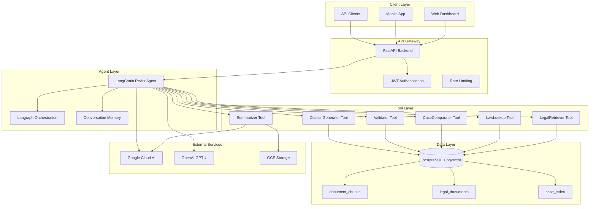

# 📋 Product Requirements Document (PRD)

## CourtSight - Legal Chatbot dengan LangChain ReAct Agent & FastAPI

**Versi:** 1.0  
**Tanggal:** September 16, 2025  
**Penulis:** CourtSight Development Team  
**Status:** Draft untuk Sprint Planning

---

## 1. Executive Summary

### 1.1 Tujuan Proyek

Pengembangan sistem chatbot hukum cerdas untuk platform CourtSight yang mengintegrasikan kemampuan **LangChain ReAct Agent** dengan orkestrasi **Langraph** dan infrastruktur **FastAPI** yang sudah ada. Proyek ini bertujuan untuk:

- **Meningkatkan akurasi** jawaban hukum dengan sitasi terverifikasi dari putusan Mahkamah Agung dan peraturan perundang-undangan
- **Mengimplementasikan reasoning multi-step** untuk analisis kasus yang kompleks
- **Menyediakan API yang scalable** untuk integrasi dengan berbagai platform (web, mobile, dashboard)
- **Memastikan transparansi** melalui logging lengkap reasoning path untuk keperluan audit legal
- Targetnya adalah sistem lawyer-grade AI assistant untuk Mahkamah Agung & praktisi hukum.

### 1.2 Scope & Out of Scope

#### ✅ In Scope (Fase 1)
- Chatbot hukum berbasis teks dengan kemampuan percakapan
- Integrasi dengan existing RAG system CourtSight
- Multi-step reasoning menggunakan LangChain ReAct Agent
- Orkestrasi workflow menggunakan Langraph
- FastAPI endpoints untuk integrasi sistem
- Logging dan audit trail reasoning path

#### ❌ Out of Scope (Fase 2+)
- Chatbot voice-based
- Multi-language support (selain Bahasa Indonesia)
- Real-time collaboration features
- Advanced document parsing (OCR, complex layouts)

### 1.3 Target Stakeholders

| Stakeholder | Kebutuhan Utama | Benefit |
|-------------|----------------|---------|
| **Hakim & Pengacara** | Riset kasus cepat, analisis preseden | Efisiensi waktu riset hingga 70% |
| **Mahasiswa Hukum** | Pembelajaran interaktif, penjelasan konsep | Akses mudah ke sumber hukum |
| **Peneliti** | Analisis komparatif, data mining | Tools analisis otomatis |
| **Masyarakat Umum** | Akses informasi hukum | Transparansi sistem hukum |

---

## 2. Business Context

### 2.1 Current State Analysis

CourtSight saat ini memiliki infrastruktur yang matang dengan:
- **Backend:** FastAPI dengan async support
- **Database:** PostgreSQL dengan pgvector untuk semantic search
- **ORM:** SQLAlchemy 2.0 dengan dataclass support
- **Authentication:** JWT-based dengan role management
- **RAG System:** Parent-child chunking dengan embedding
- **Cloud Integration:** Google Cloud Platform (Speech-to-Text, Storage, AI Platform)

### 2.2 Problem Statement

Meskipun CourtSight sudah memiliki kemampuan RAG yang powerful, namun:
- Jawaban masih bersifat statis dan tidak memiliki reasoning dinamis
- Tidak ada kemampuan multi-step analysis untuk kasus kompleks
- Sulit melakukan comparative analysis antar putusan
- Tidak ada audit trail untuk reasoning process

### 2.3 Opportunity

Chatbot dengan ReAct Agent akan memberikan:
- **Dynamic Reasoning:** Kemampuan menganalisis dan mengkombinasikan informasi dari berbagai sumber
- **Interactive Analysis:** Percakapan natural untuk eksplorasi kasus
- **Audit Compliance:** Logging lengkap untuk keperluan legal audit
- **Scalability:** API-first design untuk berbagai use cases

---

## 3. Technical Architecture

### 3.1 System Architecture Overview



### 3.2 Technology Stack

#### Core Framework
- **Backend:** FastAPI 0.116.1 (async support, auto OpenAPI docs)
- **Agent Framework:** LangChain 0.3.27 (ReAct Agent implementation)
- **Workflow Orchestration:** Langraph 0.6.6 (state machine, debugging)
- **LLM Provider:** OpenAI GPT-4o (primary), Google Gemini (fallback)

#### Database & Storage
- **Primary Database:** PostgreSQL 15+ dengan pgvector extension
- **ORM:** SQLAlchemy 2.0 dengan async support
- **Migration:** Alembic untuk schema versioning
- **Caching:** Redis untuk session dan result caching
- **File Storage:** Google Cloud Storage untuk audio/video files

#### Infrastructure
- **Containerization:** Docker dengan multi-stage builds
- **Orchestration:** Docker Compose untuk development
- **Cloud Platform:** Google Cloud Platform (GKE/Cloud Run)
- **Monitoring:** Prometheus + Grafana stack

#### Development Tools
- **Package Management:** uv (fast Python package manager)
- **Code Quality:** Ruff, MyPy, Black
- **Testing:** pytest dengan async support
- **Documentation:** MkDocs dengan Material theme

---

## 4. Functional Requirements

### 4.1 Core Chatbot Features

#### FR-1: Conversational Legal Chatbot
**Priority:** High | **Complexity:** Medium

**Description:**
Sistem chatbot yang dapat menerima pertanyaan hukum dalam bahasa natural dan memberikan jawaban dengan sitasi terverifikasi.

**Acceptance Criteria:**
- Mendukung pertanyaan dalam Bahasa Indonesia
- Response time < 6 detik untuk pertanyaan sederhana
- Akurasi sitasi > 95% (verified terhadap sumber)
- Support conversation memory untuk context

**Example Interaction:**
```
User: "Apa dasar hukum putusan No. 123/Pdt/2022 tentang sengketa tanah?"

Assistant: "Berdasarkan putusan Mahkamah Agung No. 123/Pdt/2022, dasar hukum yang digunakan adalah:

1. **Pasal 33 UUD 1945** - Tentang hak atas tanah
2. **Undang-Undang No. 5 Tahun 1960** - Tentang Peraturan Dasar Pokok-Pokok Agraria
3. **Putusan MA sebelumnya** - No. 89/Pdt/2021 yang memiliki preseden serupa

Pertimbangan hakim: [kutipan langsung dari putusan]..."
```

#### FR-2: Multi-Step Reasoning Engine
**Priority:** High | **Complexity:** High

**Description:**
Agent dapat melakukan reasoning bertahap dengan memanggil multiple tools sesuai kebutuhan analisis.

**Reasoning Flow:**
1. **Question Analysis** → Pahami intent dan complexity
2. **Information Retrieval** → Cari dokumen relevan via RAG
3. **Cross-Reference** → Validasi dengan sumber lain
4. **Synthesis** → Gabungkan informasi menjadi jawaban koheren
5. **Citation Generation** → Buat sitasi formal

#### FR-3: Tool Integration Framework
**Priority:** High | **Complexity:** Medium

**Available Tools:**

| Tool | Function | Input | Output |
|------|----------|-------|--------|
| **LegalRetriever** | Cari putusan MA via semantic search | Query text | List of relevant cases with scores |
| **LawLookup** | Query database UU & peraturan | Pasal/Undang-undang | Full text + explanation |
| **CaseComparator** | Bandingkan multiple putusan | 2-3 case IDs | Comparison table/matrix |
| **Summarizer** | Ringkas dokumen panjang | Full text | Concise summary + key points |
| **Validator** | Verifikasi akurasi klaim | Claim + source | Validation score + corrections |
| **CitationGenerator** | Generate formal citations | Case details | Formatted citations (various formats) |

### 4.2 Advanced Features

#### FR-4: Audit & Explainability
**Priority:** Medium | **Complexity:** Medium

**Requirements:**
- Logging setiap reasoning step dengan timestamp
- Recording tool calls dan parameters
- Storing intermediate results untuk debugging
- Visual workflow via Langraph Studio
- Export audit trail dalam format JSON/XML

#### FR-5: Performance & Scalability
**Priority:** Medium | **Complexity:** Medium

**Requirements:**
- Support concurrent users: 100+ simultaneous sessions
- Response time: < 10 detik untuk complex queries
- Auto-scaling berdasarkan load
- Caching layer untuk frequent queries
- Background processing untuk long-running tasks

---

## 5. Non-Functional Requirements

### 5.1 Performance Requirements

| Metric | Target | Measurement |
|--------|--------|-------------|
| **Response Time** | < 6s (simple), < 10s (complex) | 95th percentile |
| **Concurrent Users** | 100+ active sessions | Load testing |
| **Accuracy** | > 90% factual accuracy | RAGAS evaluation |
| **Uptime** | 99.9% availability | SLA monitoring |

### 5.2 Security & Compliance

#### Authentication & Authorization
- JWT-based authentication dengan role-based access
- API key management untuk external integrations
- Rate limiting per user/IP
- Audit logging untuk semua access attempts

#### Data Privacy
- Encryption at rest dan in transit
- PII masking untuk sensitive case data
- GDPR compliance untuk EU users
- Data retention policies sesuai UU PDP

#### Legal Compliance
- Sitasi akurat sesuai format MA
- Disclaimer untuk AI-generated content
- Audit trail untuk legal accountability
- Regular model updates untuk accuracy

### 5.3 Reliability & Monitoring

#### Error Handling
- Graceful degradation jika LLM unavailable
- Fallback responses dengan disclaimer
- Circuit breaker untuk external API calls
- Retry mechanisms dengan exponential backoff

#### Monitoring & Alerting
- Real-time metrics via Prometheus
- Alert untuk response time degradation
- Error rate monitoring
- Usage analytics per user/role

---

## 6. Implementation Design

### 6.1 Agent Architecture

#### ReAct Agent Configuration
```python
# src/app/services/chatbot/agent.py
from langchain_openai import ChatOpenAI
from langchain.agents import create_react_agent
from langchain_core.prompts import PromptTemplate
from langchain.memory import ConversationBufferWindowMemory

class LegalChatbotAgent:
    def __init__(self):
        self.llm = ChatOpenAI(
            model="gpt-4o",
            temperature=0.1,
            max_tokens=2000
        )

        self.memory = ConversationBufferWindowMemory(
            k=10,
            memory_key="chat_history",
            return_messages=True
        )

        self.tools = self._initialize_tools()
        self.agent = self._create_agent()

    def _initialize_tools(self):
        """Initialize CourtSight-specific legal tools"""
        return [
            LegalRetrieverTool(),
            LawLookupTool(),
            CaseComparatorTool(),
            SummarizerTool(),
            CitationGeneratorTool(),
            ValidatorTool()
        ]
```

#### Langraph Workflow
```python
# src/app/services/chatbot/workflow.py
from langgraph import StateGraph, END
from typing import TypedDict, Annotated

class AgentState(TypedDict):
    question: str
    reasoning_steps: Annotated[list, "add_step"]
    tool_calls: Annotated[list, "add_call"]
    final_answer: str
    citations: list

def create_legal_workflow():
    workflow = StateGraph(AgentState)

    # Add nodes
    workflow.add_node("analyze_question", analyze_question_node)
    workflow.add_node("retrieve_information", retrieve_node)
    workflow.add_node("validate_answer", validate_node)
    workflow.add_node("generate_response", generate_response_node)

    # Define edges
    workflow.set_entry_point("analyze_question")
    workflow.add_edge("analyze_question", "retrieve_information")
    workflow.add_edge("retrieve_information", "validate_answer")
    workflow.add_edge("validate_answer", "generate_response")
    workflow.add_edge("generate_response", END)

    return workflow.compile()
```

### 6.2 API Design

#### FastAPI Integration
```python
# src/app/api/routes/chatbot.py
from fastapi import APIRouter, Depends, BackgroundTasks
from sqlalchemy.ext.asyncio import AsyncSession

from app.core.db.database import async_get_db
from app.schemas.chatbot import (
    ChatRequest,
    ChatResponse,
    ConversationHistory
)
from app.services.chatbot import LegalChatbotService

router = APIRouter(prefix="/chat", tags=["chatbot"])

@router.post("/", response_model=ChatResponse)
async def chat_legal(
    request: ChatRequest,
    background_tasks: BackgroundTasks,
    db: AsyncSession = Depends(async_get_db),
    current_user = Depends(get_current_user)
):
    """Main chatbot endpoint for legal questions"""
    service = LegalChatbotService(db, current_user)

    # Add to background for async processing if needed
    background_tasks.add_task(
        service.log_conversation,
        request.question,
        current_user.id
    )

    response = await service.process_question(request.question)
    return response
```

#### Request/Response Schemas
```python
# src/app/schemas/chatbot.py
from pydantic import BaseModel, Field
from typing import List, Optional
from datetime import datetime

class ChatRequest(BaseModel):
    question: str = Field(..., min_length=10, max_length=2000)
    conversation_id: Optional[str] = None
    include_reasoning: bool = True

class ReasoningStep(BaseModel):
    step_number: int
    action: str
    tool_used: Optional[str]
    result: str
    timestamp: datetime

class Citation(BaseModel):
    source_type: str  # "putusan_ma", "uu", "peraturan"
    source_id: str
    title: str
    url: Optional[str]
    relevance_score: float

class ChatResponse(BaseModel):
    answer: str
    reasoning_steps: List[ReasoningStep]
    citations: List[Citation]
    conversation_id: str
    processing_time: float
    confidence_score: float
```

### 6.3 Database Schema

#### Conversation Logging
```sql
-- src/app/models/chatbot.py
class Conversation(Base):
    __tablename__ = "conversations"

    id = Column(UUID(as_uuid=True), primary_key=True, default=uuid4)
    user_id = Column(UUID(as_uuid=True), ForeignKey("users.id"))
    title = Column(String(255))
    created_at = Column(DateTime, default=datetime.utcnow)
    updated_at = Column(DateTime, default=datetime.utcnow, onupdate=datetime.utcnow)

class Message(Base):
    __tablename__ = "messages"

    id = Column(UUID(as_uuid=True), primary_key=True, default=uuid4)
    conversation_id = Column(UUID(as_uuid=True), ForeignKey("conversations.id"))
    role = Column(Enum("user", "assistant", name="message_role"))
    content = Column(Text)
    reasoning_steps = Column(JSONB)  # Store reasoning chain
    citations = Column(JSONB)  # Store citations
    created_at = Column(DateTime, default=datetime.utcnow)
```

---

## 7. Testing Strategy

### 7.1 Unit Testing
- Tool functionality testing
- Agent reasoning logic testing
- Schema validation testing

### 7.2 Integration Testing
- End-to-end conversation flows
- Database integration testing
- External API mocking

### 7.3 Performance Testing
- Load testing dengan Locust
- Memory usage monitoring
- Response time benchmarking

### 7.4 Accuracy Testing
- RAGAS evaluation framework
- Human evaluation untuk complex cases
- A/B testing dengan existing RAG system

---

## 8. Deployment & DevOps

### 8.1 Development Environment
```yaml
# docker-compose.dev.yml
version: '3.8'
services:
  chatbot-dev:
    build:
      context: .
      dockerfile: Dockerfile.dev
    volumes:
      - .:/code
      - ./credential:/credential
    environment:
      - GOOGLE_APPLICATION_CREDENTIALS=/credential/service-account.json
    ports:
      - "8000:8000"
```

### 8.2 Production Deployment
- **Container Registry:** Google Container Registry
- **Orchestration:** Google Kubernetes Engine (GKE)
- **Load Balancing:** Google Cloud Load Balancer
- **Monitoring:** Google Cloud Monitoring + Prometheus
- **Logging:** Google Cloud Logging

### 8.3 CI/CD Pipeline
```yaml
# .github/workflows/deploy.yml
name: Deploy Chatbot
on:
  push:
    branches: [main]
jobs:
  test:
    runs-on: ubuntu-latest
    steps:
      - uses: actions/checkout@v3
      - name: Run tests
        run: make test
  deploy:
    needs: test
    runs-on: ubuntu-latest
    steps:
      - name: Deploy to GKE
        uses: google-github-actions/deploy-cloudrun@main
```

---

## 9. Risk Assessment & Mitigation

### 9.1 Technical Risks

| Risk | Probability | Impact | Mitigation |
|------|-------------|--------|------------|
| **LLM Hallucination** | High | High | Validator tool, fact-checking, human oversight |
| **Performance Degradation** | Medium | Medium | Caching, optimization, monitoring |
| **External API Dependency** | Medium | High | Fallback providers, circuit breaker |
| **Data Privacy Issues** | Low | High | Encryption, access controls, audit |

### 9.2 Business Risks

| Risk | Probability | Impact | Mitigation |
|------|-------------|--------|------------|
| **Low User Adoption** | Medium | Medium | User training, documentation, feedback loops |
| **Legal Compliance Issues** | Low | High | Legal review, disclaimer, audit trail |
| **Cost Overrun** | Low | Medium | Budget monitoring, phased rollout |

---

## 10. Success Metrics & KPIs

### 10.1 User Engagement Metrics
- **Daily Active Users (DAU)** target: 500+ users
- **Average Session Duration** target: 15+ minutes
- **Question Resolution Rate** target: 85%+
- **User Satisfaction Score** target: 4.5/5

### 10.2 Technical Metrics
- **Response Accuracy** target: 90%+ (RAGAS score)
- **Average Response Time** target: < 6 seconds
- **System Uptime** target: 99.9%
- **Error Rate** target: < 1%

### 10.3 Business Impact Metrics
- **Time Savings** for legal research: 60-70%
- **Cost Reduction** in legal research: 40-50%
- **Case Analysis Speed** improvement: 3x faster
- **User Productivity** increase: 2x

---

## 11. Implementation Roadmap

### Phase 1: Foundation (Sprint 1-2)
- [ ] Agent core implementation
- [ ] Basic tool integration
- [ ] FastAPI endpoints
- [ ] Database schema for conversations

### Phase 2: Enhancement (Sprint 3-4)
- [ ] Advanced reasoning capabilities
- [ ] Langraph workflow optimization
- [ ] Performance optimization
- [ ] Comprehensive testing

### Phase 3: Production (Sprint 5-6)
- [ ] Production deployment
- [ ] Monitoring setup
- [ ] User acceptance testing
- [ ] Go-live preparation

---

## 12. References & Resources

### Technical Documentation
- [LangChain ReAct Agents](https://python.langchain.com/docs/modules/agents/agent_types/react)
- [Langraph Documentation](https://langchain-ai.github.io/langgraph/)
- [FastAPI Best Practices](https://fastapi.tiangolo.com/tutorial/)
- [pgvector Documentation](https://github.com/pgvector/pgvector)

### CourtSight Architecture
- [CourtSight API Documentation](./../api/)
- [Database Schema Documentation](./../database/)
- [Deployment Guide](./../production/)

### Legal Resources
- [Mahkamah Agung RI](https://www.mahkamahagung.go.id)
- [Undang-Undang Database](https://peraturan.go.id)
- [Legal Citation Standards](https://www.legalcitation.org)

---

**Document Version History:**
- v1.0 (2025-09-16): Initial PRD with CourtSight integration details
- Draft for Sprint Planning and stakeholder review