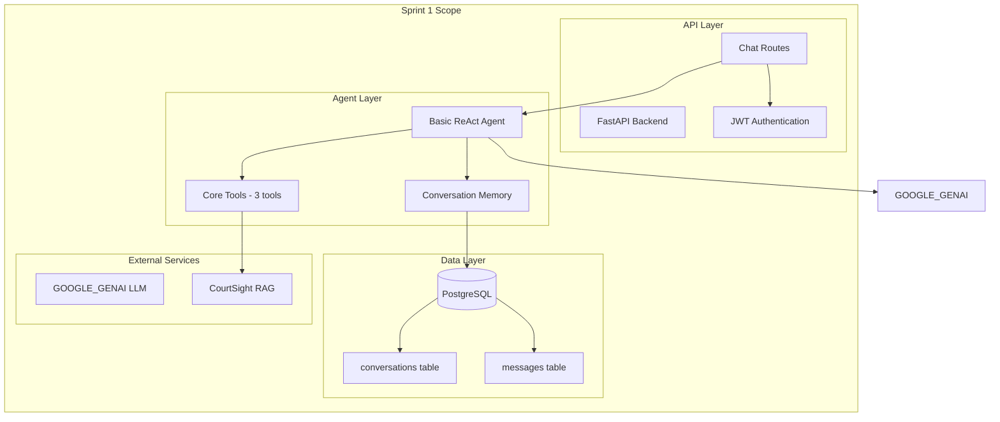

# 📋 Sprint 1 - Foundation & Core Architecture

## CourtSight Legal Chatbot - Sprint 1 Implementation Plan

**Sprint:** 1 (Foundation & Core Architecture)  
**Tanggal:** September 16, 2025  
**Durasi:** 2 minggu  
**Status:** Sprint Planning  

---

## Sprint 1 Overview

### 🎯 Sprint Goals
Membangun fondasi chatbot hukum dengan implementasi **LangChain ReAct Agent** dan infrastruktur dasar untuk integrasi dengan CourtSight existing system.

### ✅ Sprint Objectives
1. **Agent Core Implementation** - Setup LangChain ReAct Agent dengan basic tools
2. **Database Schema** - Create conversation & message models 
3. **Basic API Endpoints** - Minimal FastAPI routes untuk chat functionality
4. **Authentication Integration** - Integrasi dengan JWT-based auth CourtSight
5. **Foundation Testing** - Unit tests untuk core components

---

## 1. Executive Summary

### 1.1 Tujuan Sprint 1

Pengembangan sistem chatbot hukum cerdas untuk platform CourtSight yang mengintegrasikan kemampuan **LangChain ReAct Agent** dengan infrastruktur **FastAPI** yang sudah ada. Sprint 1 fokus pada:

- **Setup Agent Foundation** dengan LangChain ReAct Agent basic implementation
- **Database Integration** untuk conversation logging dan audit trail
- **API Endpoints** minimal untuk chat functionality
- **Authentication** integration dengan existing JWT system
- **Testing Framework** untuk memastikan quality dan reliability

### 1.2 Sprint 1 Scope

#### ✅ In Scope Sprint 1
- Basic ReAct Agent implementation dengan 2-3 core tools
- Database schema untuk conversations dan messages
- FastAPI endpoints untuk basic chat functionality
- Authentication middleware integration
- Unit testing framework setup
- Basic conversation memory implementation

#### ❌ Out of Scope Sprint 1
- Advanced tool integration (akan di Sprint 2)
- Langraph workflow orchestration (Sprint 2-3)
- Performance optimization (Sprint 3)
- Production deployment (Sprint 3)

---

## 2. Technical Architecture - Sprint 1

### 2.1 Core Components Sprint 1



### 2.2 Technology Stack Sprint 1

#### Core Framework
- **Backend:** FastAPI 0.116.1 (existing)
- **Agent Framework:** LangChain 0.3.27 (new)
- **LLM Provider:** GOOGLE_GENAI
- **Database:** PostgreSQL 15+ dengan existing schema (extend)


## 3. Functional Requirements - Sprint 1

### 3.1 Core Features Sprint 1

#### FR-1.1: Basic Conversational Chatbot
**Priority:** High | **Complexity:** Medium | **Sprint:** 1

**Description:**
Implementasi basic chatbot yang dapat menerima pertanyaan hukum sederhana dan memberikan jawaban menggunakan ReAct Agent.

**Acceptance Criteria:**
- User dapat mengirim pertanyaan via POST /api/v1/chat
- System dapat memproses pertanyaan dengan ReAct Agent
- Response time < 10 detik untuk pertanyaan sederhana
- Conversation memory tersimpan di database

**Technical Implementation:**
```python
# src/app/services/chatbot/basic_agent.py
from langchain.agents import create_react_agent
from langchain.memory import ConversationBufferMemory


llm_service import get_llm_service
class BasicLegalChatbot:
    def __init__(self):
        self.llm = get_llm_service().llm
        self.memory = ConversationBufferMemory()
        self.tools = self._init_basic_tools()
        self.agent = self._create_agent()
```

#### FR-1.2: Basic Tool Integration
**Priority:** High | **Complexity:** Medium | **Sprint:** 1

**Sprint 1 Tools (3 core tools):**

| Tool | Function | Input | Output | Sprint 1 Status |
|------|----------|-------|--------|-----------------|
| **LegalSearchTool** | Basic search via existing RAG | Query text | Top 5 relevant docs | ✅ Implement |
| **BasicSummarizerTool** | Simple text summarization | Full text | Summary < 200 words | ✅ Implement |
| **ValidatorTool** | Basic fact checking | Claim + source | True/False + confidence | ✅ Implement |

**Implementation Example:**
```python
# src/app/services/chatbot/tools/legal_search_tool.py
from langchain.tools import BaseTool
from app.services.rag import RAGService

class LegalSearchTool(BaseTool):
    name = "legal_search"
    description = "Search for legal documents and court decisions"
    
    def _run(self, query: str) -> str:
        rag_service = RAGService()
        results = rag_service.search(query, limit=5)
        return self._format_results(results)
```

#### FR-1.3: Database Schema
**Priority:** High | **Complexity:** Low | **Sprint:** 1

**New Tables Sprint 1:**
```sql
-- conversations table
CREATE TABLE conversations (
    id UUID PRIMARY KEY DEFAULT uuid_generate_v4(),
    user_id UUID REFERENCES users(id),
    title VARCHAR(255),
    created_at TIMESTAMP DEFAULT NOW(),
    updated_at TIMESTAMP DEFAULT NOW()
);

-- messages table  
CREATE TABLE messages (
    id UUID PRIMARY KEY DEFAULT uuid_generate_v4(),
    conversation_id UUID REFERENCES conversations(id),
    role VARCHAR(20) CHECK (role IN ('user', 'assistant')),
    content TEXT NOT NULL,
    reasoning_steps JSONB,
    tool_calls JSONB,
    created_at TIMESTAMP DEFAULT NOW()
);
```

#### FR-1.4: API Endpoints Sprint 1
**Priority:** High | **Complexity:** Medium | **Sprint:** 1

**Endpoints Sprint 1:**
```python
# src/app/api/routes/chatbot.py
from fastapi import APIRouter, Depends
from app.schemas.chatbot import ChatRequest, ChatResponse

router = APIRouter(prefix="/chat", tags=["chatbot"])

@router.post("/", response_model=ChatResponse)
async def chat_basic(
    request: ChatRequest,
    current_user = Depends(get_current_user)
):
    """Basic chat endpoint for Sprint 1"""
    pass

@router.get("/conversations", response_model=List[ConversationSummary])
async def get_conversations(
    current_user = Depends(get_current_user)
):
    """Get user's conversation history"""
    pass

@router.get("/conversations/{conversation_id}")
async def get_conversation_detail(
    conversation_id: UUID,
    current_user = Depends(get_current_user)
):
    """Get specific conversation with messages"""
    pass
```

---

## 4. Implementation Design - Sprint 1

### 4.1 Agent Architecture Sprint 1

#### Basic ReAct Agent Setup
```python
# src/app/services/chatbot/agent.py
from .llm_service import get_llm_service
from langchain.agents import create_react_agent, AgentExecutor
from langchain_core.prompts import PromptTemplate
from langchain.memory import ConversationBufferMemory

class LegalChatbotAgentV1:
    """Sprint 1 - Basic implementation"""
    
    def __init__(self):
        self.llm = get_llm_service().llm
        
        self.tools = self._initialize_basic_tools()
        self.memory = ConversationBufferMemory(
            memory_key="chat_history",
            return_messages=True
        )
        
        self.agent = self._create_basic_agent()
    
    def _initialize_basic_tools(self):
        """Initialize 3 core tools for Sprint 1"""
        from .tools import LegalSearchTool, BasicSummarizerTool, ValidatorTool
        
        return [
            LegalSearchTool(),
            BasicSummarizerTool(), 
            ValidatorTool()
        ]
    
    def _create_basic_agent(self):
        """Create basic ReAct agent"""
        prompt = PromptTemplate.from_template("""
        Anda adalah asisten hukum AI untuk CourtSight. Gunakan tools yang tersedia untuk menjawab pertanyaan hukum.
        
        Tools tersedia:
        {tools}
        
        Format jawaban:
        Thought: [analisis pertanyaan]
        Action: [tool yang digunakan]
        Action Input: [input untuk tool]
        Observation: [hasil dari tool]
        ... (ulangi jika perlu)
        Final Answer: [jawaban final dengan sitasi]
        
        Question: {input}
        {agent_scratchpad}
        """)
        
        agent = create_react_agent(self.llm, self.tools, prompt)
        return AgentExecutor(agent=agent, tools=self.tools, verbose=True)
```

### 4.2 Database Models Sprint 1

```python
# src/app/models/chatbot.py
from sqlalchemy import Column, String, Text, DateTime, ForeignKey, Enum
from sqlalchemy.dialects.postgresql import UUID, JSONB
from sqlalchemy.orm import relationship
from datetime import datetime
from uuid import uuid4

class Conversation(Base):
    __tablename__ = "conversations"
    
    id = Column(UUID(as_uuid=True), primary_key=True, default=uuid4)
    user_id = Column(UUID(as_uuid=True), ForeignKey("users.id"), nullable=False)
    title = Column(String(255))
    created_at = Column(DateTime, default=datetime.utcnow)
    updated_at = Column(DateTime, default=datetime.utcnow, onupdate=datetime.utcnow)
    
    # Relationships
    user = relationship("User", back_populates="conversations")
    messages = relationship("Message", back_populates="conversation", cascade="all, delete-orphan")

class Message(Base):
    __tablename__ = "messages"
    
    id = Column(UUID(as_uuid=True), primary_key=True, default=uuid4)
    conversation_id = Column(UUID(as_uuid=True), ForeignKey("conversations.id"), nullable=False)
    role = Column(Enum("user", "assistant", name="message_role"), nullable=False)
    content = Column(Text, nullable=False)
    reasoning_steps = Column(JSONB)  # Agent reasoning untuk audit
    tool_calls = Column(JSONB)       # Tool calls untuk debugging
    created_at = Column(DateTime, default=datetime.utcnow)
    
    # Relationships
    conversation = relationship("Conversation", back_populates="messages")
```

### 4.3 Pydantic Schemas Sprint 1

```python
# src/app/schemas/chatbot.py
from pydantic import BaseModel, Field
from typing import List, Optional, Dict, Any
from datetime import datetime
from uuid import UUID

class ChatRequest(BaseModel):
    message: str = Field(..., min_length=5, max_length=1000)
    conversation_id: Optional[UUID] = None

class ToolCall(BaseModel):
    tool_name: str
    input_data: Dict[str, Any]
    output_data: str
    execution_time: float

class ChatResponse(BaseModel):
    message: str
    conversation_id: UUID
    reasoning_steps: Optional[List[str]] = []
    tool_calls: Optional[List[ToolCall]] = []
    processing_time: float
    timestamp: datetime

class ConversationSummary(BaseModel):
    id: UUID
    title: str
    last_message: str
    message_count: int
    created_at: datetime
    updated_at: datetime

class ConversationDetail(BaseModel):
    id: UUID
    title: str
    messages: List[Dict[str, Any]]
    created_at: datetime
```

---

## 5. Testing Strategy - Sprint 1

### 5.1 Unit Testing Sprint 1
```python
# tests/test_chatbot_agent.py
import pytest
from app.services.chatbot.agent import LegalChatbotAgentV1

class TestLegalChatbotAgent:
    
    @pytest.fixture
    def agent(self):
        return LegalChatbotAgentV1()
    
    def test_agent_initialization(self, agent):
        """Test agent initializes with correct tools"""
        assert len(agent.tools) == 3
        assert agent.llm.model_name == "gpt-4o"
    
    def test_basic_question_processing(self, agent):
        """Test basic question processing"""
        response = agent.process_question("Apa itu hukum perdata?")
        assert response is not None
        assert len(response) > 0
    
    def test_tool_calling(self, agent):
        """Test tool calling functionality"""
        # Mock implementation
        pass
```

### 5.2 Integration Testing Sprint 1
```python
# tests/test_chatbot_api.py
import pytest
from fastapi.testclient import TestClient
from app.main import app

client = TestClient(app)

class TestChatbotAPI:
    
    def test_chat_endpoint_basic(self):
        """Test basic chat endpoint"""
        response = client.post(
            "/api/v1/chat/",
            json={"message": "Apa itu hukum pidana?"},
            headers={"Authorization": "Bearer test_token"}
        )
        assert response.status_code == 200
        assert "message" in response.json()
    
    def test_conversation_creation(self):
        """Test conversation creation"""
        response = client.get(
            "/api/v1/chat/conversations",
            headers={"Authorization": "Bearer test_token"}
        )
        assert response.status_code == 200
```

---

## 6. Sprint 1 Deliverables

### 6.1 Code Deliverables
- [ ] `src/app/services/chatbot/agent.py` - Basic ReAct Agent implementation
- [ ] `src/app/services/chatbot/tools/` - 3 core tools (LegalSearch, Summarizer, Validator)
- [ ] `src/app/models/chatbot.py` - Database models untuk conversations & messages
- [ ] `src/app/schemas/chatbot.py` - Pydantic schemas untuk API
- [ ] `src/app/api/routes/chatbot.py` - Basic API endpoints
- [ ] `src/migrations/` - Database migration scripts
- [ ] `tests/test_chatbot_*` - Unit dan integration tests

### 6.2 Documentation Deliverables
- [ ] API Documentation (OpenAPI/Swagger) untuk chat endpoints
- [ ] Database schema documentation
- [ ] Agent configuration guide
- [ ] Testing documentation

### 6.3 Configuration Deliverables
- [ ] Database configuration updates
- [ ] Docker compose updates untuk development

---

## 7. Sprint 1 Tasks Breakdown

### Week 1 (Days 1-5)
**Day 1-2: Project Setup**
- [ ] Setup LangChain dependencies di pyproject.toml
- [ ] Create basic project structure untuk chatbot services
- [ ] Create database migration untuk conversations & messages tables

**Day 3-4: Core Agent Implementation**  
- [ ] Implement LegalChatbotAgentV1 class
- [ ] Create basic ReAct agent dengan prompt template
- [ ] Implement conversation memory
- [ ] Unit tests untuk agent core

**Day 5: Basic Tools Implementation**
- [ ] Implement LegalSearchTool (integrate dengan existing RAG)
- [ ] Implement BasicSummarizerTool 
- [ ] Implement ValidatorTool
- [ ] Unit tests untuk tools

### Week 2 (Days 6-10)
**Day 6-7: API Implementation**
- [ ] Create FastAPI routes untuk chat endpoints
- [ ] Implement authentication middleware integration
- [ ] Create Pydantic schemas untuk request/response
- [ ] Integration tests untuk API

**Day 8-9: Database Integration**
- [ ] Implement database models dengan SQLAlchemy
- [ ] Create CRUD operations untuk conversations & messages
- [ ] Implement conversation memory persistence
- [ ] Database integration tests

**Day 10: Testing & Documentation**
- [ ] Comprehensive testing (unit + integration)
- [ ] API documentation dengan OpenAPI
- [ ] Sprint 1 demo preparation
- [ ] Code review dan bug fixes

---

## 8. Success Criteria Sprint 1

### 8.1 Functional Success Criteria
- ✅ User dapat mengajukan pertanyaan hukum dasar via API
- ✅ Agent dapat menggunakan minimal 3 tools untuk menjawab
- ✅ Conversation tersimpan dan dapat diakses
- ✅ Response time < 10 detik untuk pertanyaan sederhana
- ✅ Authentication terintegrasi dengan existing system

### 8.2 Technical Success Criteria  
- ✅ Code coverage > 80% untuk core components
- ✅ All tests passing (unit + integration)
- ✅ API documentation complete dan accurate
- ✅ Database migration berjalan tanpa error
- ✅ Container dapat dijalankan di development environment

### 8.3 Quality Criteria
- ✅ Code review completed untuk semua components
- ✅ Security review untuk API endpoints
- ✅ Performance baseline established
- ✅ Error handling implemented
- ✅ Logging implemented untuk debugging

---

## 9. Risks & Mitigation Sprint 1

### 9.1 Technical Risks Sprint 1

| Risk | Probability | Impact | Mitigation |
|------|-------------|--------|------------|
| **LLM Integration Issues** | Medium | High | Early testing with mock LLM, fallback mechanisms |
| **Memory Consumption** | Medium | Low | Monitor memory usage, implement conversation limits |
| **Database Performance** | Low | Medium | Index optimization, query monitoring |
| **Integration Complexity** | Medium | Medium | Incremental integration, thorough testing |

### 9.2 Project Risks Sprint 1

| Risk | Probability | Impact | Mitigation |
|------|-------------|--------|------------|
| **Scope Creep** | High | Medium | Strict sprint scope adherence, backlog management |
| **Learning Curve** | Medium | Medium | Pair programming, knowledge sharing sessions |
| **Dependency Issues** | Low | High | Early dependency setup, version pinning |

---

## 10. Sprint 1 Definition of Done

### Individual Task DoD
- [ ] Code implemented dan tested
- [ ] Unit tests written dan passing
- [ ] Code review completed
- [ ] Documentation updated
- [ ] No critical security vulnerabilities

### Sprint DoD
- [ ] All acceptance criteria met
- [ ] Integration tests passing
- [ ] API documentation complete
- [ ] Demo successfully conducted
- [ ] Sprint retrospective completed
- [ ] Next sprint planning completed

---

**Sprint 1 Document Version:**
- v1.0 (2025-09-16): Initial Sprint 1 implementation plan
- Target completion: 2 weeks from sprint start