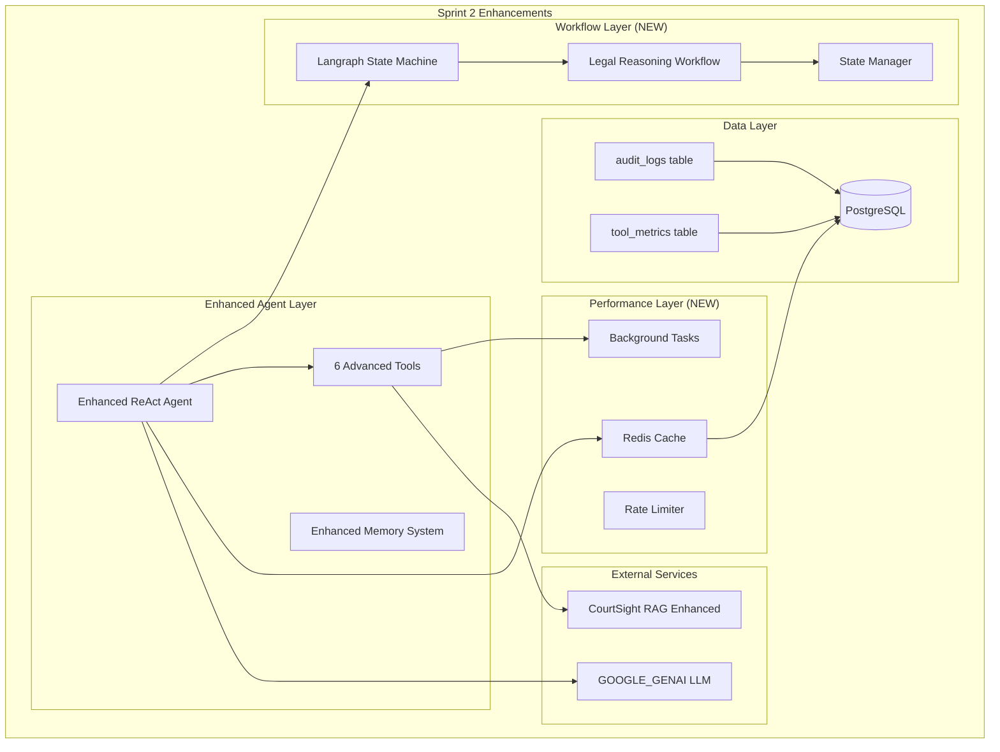

# 📋 Sprint 2 - Advanced Features & Workflow Orchestration

## CourtSight Legal Chatbot - Sprint 2 Implementation Plan

**Sprint:** 2 (Advanced Features & Workflow Orchestration)  
**Tanggal:** September 30, 2025  
**Durasi:** 2 minggu  
**Status:** Sprint Planning  

---

## Sprint 2 Overview

### 🎯 Sprint Goals
Implementasi advanced tools, **Langraph workflow orchestration**, dan enhanced reasoning capabilities untuk chatbot hukum CourtSight.

### ✅ Sprint Objectives
1. **Langraph Integration** - State machine workflow untuk complex reasoning
2. **Advanced Tools** - CaseComparator, PrecedentExplorer, CitationGenerator
3. **Enhanced Agent** - Multi-step reasoning dengan audit trail
4. **Performance Optimization** - Caching, async processing, load balancing
5. **Advanced Testing** - Load testing, accuracy testing (RAGAS)

---

## 1. Sprint 2 Technical Architecture

### 1.1 Enhanced System Architecture



### 1.2 New Dependencies Sprint 2

```toml
# Additional dependencies untuk Sprint 2
langgraph = "0.6.6"
redis = "5.3.1"
hiredis = "3.2.1"  # Redis performance
ragas = "0.3.2"     # Accuracy evaluation
prometheus-client = "0.21.1"  # Metrics
asyncio-throttle = "1.0.2"    # Rate limiting
```

---

## 2. Functional Requirements - Sprint 2

### 2.1 Advanced Tool Integration

#### FR-2.1: CaseComparator Tool
**Priority:** High | **Complexity:** High | **Sprint:** 2

**Description:**
Tool untuk membandingkan 2-3 putusan pengadilan terkait isu hukum yang sama dengan analisis komparatif mendalam.

**Acceptance Criteria:**
- Input: 2-3 case IDs atau case names
- Output: Structured comparison table (dasar hukum, amar, pertimbangan)
- Support semantic similarity analysis
- Processing time < 15 detik untuk 3 cases

**Implementation:**
```python
# src/app/services/chatbot/tools/case_comparator.py
from langchain.tools import BaseTool
from typing import List, Dict
import asyncio

class CaseComparatorTool(BaseTool):
    name = "case_comparator"
    description = "Compare multiple court decisions for similarities and differences"
    
    async def _arun(self, case_identifiers: List[str]) -> str:
        """Compare cases asynchronously"""
        cases = await self._fetch_cases(case_identifiers)
        comparison = await self._analyze_cases(cases)
        return self._format_comparison(comparison)
    
    async def _fetch_cases(self, identifiers: List[str]) -> List[Dict]:
        """Fetch case details from database"""
        tasks = [self._get_case_detail(id) for id in identifiers]
        return await asyncio.gather(*tasks)
    
    async def _analyze_cases(self, cases: List[Dict]) -> Dict:
        """Perform comparative analysis"""
        return {
            "legal_basis_comparison": self._compare_legal_basis(cases),
            "judicial_reasoning": self._compare_reasoning(cases),
            "verdict_analysis": self._compare_verdicts(cases),
            "precedent_value": self._assess_precedent_value(cases)
        }
```

#### FR-2.2: PrecedentExplorer Tool  
**Priority:** High | **Complexity:** High | **Sprint:** 2

**Description:**
Tool untuk menelusuri preseden hukum menggunakan semantic similarity search pada putusan terdahulu.

**Features:**
- Semantic search pada case database
- Timeline analysis preseden
- Strength assessment preseden value
- Related cases discovery

**Implementation:**
```python
# src/app/services/chatbot/tools/precedent_explorer.py
from langchain.tools import BaseTool
from app.services.vector_search import VectorSearchService
import numpy as np

class PrecedentExplorerTool(BaseTool):
    name = "precedent_explorer"
    description = "Find legal precedents using semantic similarity"
    
    def __init__(self):
        self.vector_service = VectorSearchService()
        
    async def _arun(self, legal_issue: str, similarity_threshold: float = 0.7) -> str:
        """Find relevant precedents"""
        # Embed the legal issue
        query_embedding = await self._embed_legal_issue(legal_issue)
        
        # Search for similar cases
        similar_cases = await self.vector_service.similarity_search(
            query_embedding, 
            threshold=similarity_threshold,
            collection="legal_precedents"
        )
        
        # Analyze precedent strength
        precedent_analysis = await self._analyze_precedent_strength(similar_cases)
        
        return self._format_precedent_report(precedent_analysis)
```

#### FR-2.3: CitationGenerator Tool
**Priority:** Medium | **Complexity:** Medium | **Sprint:** 2

**Description:**
Tool untuk menghasilkan sitasi formal dalam berbagai format (Indonesian legal, APA, IEEE).

**Supported Formats:**
- Format Mahkamah Agung Indonesia
- Format akademis (APA, MLA)
- Format legal brief
- BibTeX export

**Implementation:**
```python
# src/app/services/chatbot/tools/citation_generator.py
from langchain.tools import BaseTool
from enum import Enum

class CitationFormat(Enum):
    MA_INDONESIA = "ma_indonesia"
    APA = "apa"
    LEGAL_BRIEF = "legal_brief"
    BIBTEX = "bibtex"

class CitationGeneratorTool(BaseTool):
    name = "citation_generator"
    description = "Generate formal legal citations in various formats"
    
    def _run(self, case_details: dict, format_type: str = "ma_indonesia") -> str:
        """Generate citation based on format"""
        formatter = self._get_formatter(CitationFormat(format_type))
        return formatter.format_citation(case_details)
    
    def _get_formatter(self, format_type: CitationFormat):
        """Factory method for citation formatters"""
        formatters = {
            CitationFormat.MA_INDONESIA: MAIndonesiaFormatter(),
            CitationFormat.APA: APAFormatter(),
            CitationFormat.LEGAL_BRIEF: LegalBriefFormatter(),
            CitationFormat.BIBTEX: BibTeXFormatter()
        }
        return formatters[format_type]
```

### 2.2 Langraph Workflow Integration

#### FR-2.4: State Machine Workflow
**Priority:** High | **Complexity:** High | **Sprint:** 2

**Description:**
Implementasi Langraph state machine untuk mengelola complex reasoning workflows dengan audit trail.

**Workflow States:**
1. **Question Analysis** - Analyze question complexity and intent
2. **Information Gathering** - Multi-tool information retrieval
3. **Cross-Validation** - Verify information across sources
4. **Synthesis** - Combine information into coherent answer
5. **Citation Generation** - Generate proper citations
6. **Quality Check** - Final validation before response

**Implementation:**
```python
# src/app/services/chatbot/workflow.py
from langgraph import StateGraph, END
from typing import TypedDict, Annotated, List
import asyncio

class LegalReasoningState(TypedDict):
    question: str
    question_analysis: dict
    gathered_information: Annotated[List[dict], "add_info"]
    cross_validation_results: dict
    synthesized_answer: str
    citations: List[dict]
    quality_score: float
    reasoning_path: Annotated[List[str], "add_step"]

class LegalWorkflow:
    def __init__(self):
        self.workflow = self._create_workflow()
    
    def _create_workflow(self) -> StateGraph:
        """Create the legal reasoning workflow"""
        workflow = StateGraph(LegalReasoningState)
        
        # Add nodes
        workflow.add_node("analyze_question", self.analyze_question)
        workflow.add_node("gather_information", self.gather_information)
        workflow.add_node("cross_validate", self.cross_validate)
        workflow.add_node("synthesize_answer", self.synthesize_answer)
        workflow.add_node("generate_citations", self.generate_citations)
        workflow.add_node("quality_check", self.quality_check)
        
        # Define workflow edges
        workflow.set_entry_point("analyze_question")
        workflow.add_conditional_edges(
            "analyze_question",
            self._should_gather_more_info,
            {
                "simple": "synthesize_answer",
                "complex": "gather_information"
            }
        )
        workflow.add_edge("gather_information", "cross_validate")
        workflow.add_edge("cross_validate", "synthesize_answer")
        workflow.add_edge("synthesize_answer", "generate_citations")
        workflow.add_edge("generate_citations", "quality_check")
        workflow.add_edge("quality_check", END)
        
        return workflow.compile()
    
    async def analyze_question(self, state: LegalReasoningState) -> LegalReasoningState:
        """Analyze question complexity and intent"""
        analysis = await self._analyze_question_complexity(state["question"])
        state["question_analysis"] = analysis
        state["reasoning_path"].append(f"Question analyzed: {analysis['complexity']}")
        return state
    
    async def gather_information(self, state: LegalReasoningState) -> LegalReasoningState:
        """Gather information using multiple tools"""
        tools_to_use = self._determine_tools(state["question_analysis"])
        
        # Run tools in parallel where possible
        tasks = []
        for tool_name in tools_to_use:
            tool = self._get_tool(tool_name)
            tasks.append(tool.ainvoke(state["question"]))
        
        results = await asyncio.gather(*tasks)
        
        for i, result in enumerate(results):
            state["gathered_information"].append({
                "tool": tools_to_use[i],
                "result": result,
                "timestamp": datetime.utcnow()
            })
        
        state["reasoning_path"].append(f"Information gathered using {len(tools_to_use)} tools")
        return state
```

### 2.3 Enhanced Memory System

#### FR-2.5: Advanced Conversation Memory
**Priority:** Medium | **Complexity:** Medium | **Sprint:** 2

**Features:**
- Long-term conversation context
- Entity tracking across conversations  
- Topic clustering
- Conversation summarization

**Implementation:**
```python
# src/app/services/chatbot/memory/enhanced_memory.py
from langchain.memory import ConversationSummaryBufferMemory
from langchain.schema import BaseMessage
import json

class EnhancedLegalMemory:
    def __init__(self, llm, max_token_limit: int = 2000):
        self.summary_memory = ConversationSummaryBufferMemory(
            llm=llm,
            max_token_limit=max_token_limit,
            return_messages=True
        )
        self.entity_tracker = LegalEntityTracker()
        self.topic_clusterer = TopicClusterer()
    
    async def add_message(self, message: BaseMessage, conversation_id: str):
        """Add message with entity and topic tracking"""
        # Add to summary memory
        self.summary_memory.chat_memory.add_message(message)
        
        # Track legal entities
        entities = await self.entity_tracker.extract_entities(message.content)
        await self._store_entities(conversation_id, entities)
        
        # Update topic clusters
        await self.topic_clusterer.update_clusters(conversation_id, message.content)
    
    async def get_relevant_context(self, current_question: str, conversation_id: str) -> str:
        """Get relevant context for current question"""
        # Get conversation summary
        summary = self.summary_memory.buffer
        
        # Get relevant entities
        relevant_entities = await self.entity_tracker.get_relevant_entities(
            current_question, conversation_id
        )
        
        # Get related topics
        related_topics = await self.topic_clusterer.get_related_topics(current_question)
        
        return self._format_context(summary, relevant_entities, related_topics)
```

---

## 3. Performance Optimization - Sprint 2

### 3.1 Caching Strategy

#### Redis Integration
```python
# src/app/services/cache/redis_cache.py
import redis.asyncio as redis
import json
from typing import Optional, Any
import hashlib

class LegalChatCache:
    def __init__(self, redis_url: str):
        self.redis = redis.from_url(redis_url)
        self.default_ttl = 3600  # 1 hour
    
    async def get_tool_result(self, tool_name: str, input_hash: str) -> Optional[str]:
        """Get cached tool result"""
        cache_key = f"tool:{tool_name}:{input_hash}"
        cached_result = await self.redis.get(cache_key)
        return json.loads(cached_result) if cached_result else None
    
    async def cache_tool_result(self, tool_name: str, input_data: str, result: Any, ttl: int = None):
        """Cache tool result"""
        input_hash = hashlib.md5(input_data.encode()).hexdigest()
        cache_key = f"tool:{tool_name}:{input_hash}"
        
        await self.redis.setex(
            cache_key,
            ttl or self.default_ttl,
            json.dumps(result)
        )
    
    async def get_conversation_summary(self, conversation_id: str) -> Optional[dict]:
        """Get cached conversation summary"""
        cache_key = f"conversation:summary:{conversation_id}"
        cached_summary = await self.redis.get(cache_key)
        return json.loads(cached_summary) if cached_summary else None
```

### 3.2 Background Task Processing

```python
# src/app/services/background/task_processor.py
from celery import Celery
from app.services.chatbot.agent import EnhancedLegalAgent
import asyncio

# Celery setup untuk background tasks
celery_app = Celery('legal_chatbot')

@celery_app.task
async def process_complex_query(question: str, conversation_id: str, user_id: str):
    """Process complex queries in background"""
    agent = EnhancedLegalAgent()
    
    try:
        result = await agent.process_complex_question(question)
        
        # Store result in database
        await store_processing_result(conversation_id, result)
        
        # Notify user via websocket or callback
        await notify_user_completion(user_id, conversation_id, result)
        
    except Exception as e:
        await handle_processing_error(conversation_id, str(e))

@celery_app.task  
async def update_precedent_index():
    """Background task to update precedent similarity index"""
    from app.services.vector_search import VectorSearchService
    
    vector_service = VectorSearchService()
    await vector_service.rebuild_precedent_index()
```

---

## 4. Testing Strategy - Sprint 2

### 4.1 Accuracy Testing dengan RAGAS

```python
# tests/test_accuracy_ragas.py
from ragas import evaluate
from ragas.metrics import (
    faithfulness,
    answer_relevancy,
    context_precision,
    context_recall
)
from datasets import Dataset

class TestLegalChatbotAccuracy:
    
    async def test_legal_qa_accuracy(self):
        """Test chatbot accuracy using RAGAS metrics"""
        
        # Prepare test dataset
        test_questions = [
            "Apa dasar hukum perceraian dalam hukum Indonesia?",
            "Bagaimana prosedur pembuktian dalam perkara pidana?",
            "Apa perbedaan antara hak milik dan hak guna bangunan?"
        ]
        
        # Get chatbot responses
        responses = []
        contexts = []
        ground_truths = []
        
        for question in test_questions:
            response = await self.chatbot.process_question(question)
            responses.append(response.answer)
            contexts.append(response.retrieved_contexts)
            ground_truths.append(self._get_ground_truth(question))
        
        # Create dataset
        dataset = Dataset.from_dict({
            "question": test_questions,
            "answer": responses,
            "contexts": contexts,
            "ground_truths": ground_truths
        })
        
        # Evaluate using RAGAS
        result = evaluate(
            dataset,
            metrics=[
                faithfulness,
                answer_relevancy,
                context_precision,
                context_recall
            ]
        )
        
        # Assert minimum accuracy thresholds
        assert result["faithfulness"] > 0.8
        assert result["answer_relevancy"] > 0.75
        assert result["context_precision"] > 0.7
```

### 4.2 Load Testing

```python
# tests/test_load_performance.py
import asyncio
import aiohttp
import time
from concurrent.futures import ThreadPoolExecutor

class TestChatbotLoad:
    
    async def test_concurrent_users(self):
        """Test chatbot performance with concurrent users"""
        
        async def simulate_user_session():
            """Simulate a user chat session"""
            async with aiohttp.ClientSession() as session:
                start_time = time.time()
                
                # Send multiple questions in sequence
                questions = [
                    "Apa itu hukum perdata?",
                    "Bagaimana cara mengajukan gugatan?",
                    "Apa persyaratan untuk menjadi saksi?"
                ]
                
                for question in questions:
                    async with session.post(
                        "http://localhost:8000/api/v1/chat/",
                        json={"message": question},
                        headers={"Authorization": "Bearer test_token"}
                    ) as response:
                        assert response.status == 200
                        result = await response.json()
                        assert "message" in result
                
                end_time = time.time()
                return end_time - start_time
        
        # Run 50 concurrent user sessions
        tasks = [simulate_user_session() for _ in range(50)]
        session_times = await asyncio.gather(*tasks)
        
        # Assert performance requirements
        avg_session_time = sum(session_times) / len(session_times)
        assert avg_session_time < 30  # Average session < 30 seconds
        assert max(session_times) < 60  # No session > 60 seconds
```

---

## 5. Sprint 2 Deliverables

### 5.1 Code Deliverables
- [ ] `src/app/services/chatbot/workflow.py` - Langraph workflow implementation
- [ ] `src/app/services/chatbot/tools/advanced/` - 3 advanced tools (CaseComparator, PrecedentExplorer, CitationGenerator)
- [ ] `src/app/services/chatbot/memory/enhanced_memory.py` - Enhanced memory system
- [ ] `src/app/services/cache/` - Redis caching implementation
- [ ] `src/app/services/background/` - Background task processing
- [ ] `src/app/core/metrics.py` - Prometheus metrics integration
- [ ] `tests/test_accuracy_ragas.py` - RAGAS accuracy testing
- [ ] `tests/test_load_performance.py` - Load testing suite

### 5.2 Infrastructure Deliverables
- [ ] Redis configuration untuk caching
- [ ] Celery setup untuk background tasks
- [ ] Prometheus metrics collection setup
- [ ] Enhanced Docker compose untuk development
- [ ] Performance monitoring dashboard (Grafana)

### 5.3 Documentation Deliverables
- [ ] Langraph workflow documentation
- [ ] Advanced tools usage guide
- [ ] Performance optimization guide
- [ ] Accuracy testing methodology
- [ ] Caching strategy documentation

---

## 6. Sprint 2 Tasks Breakdown

### Week 1 (Days 1-5)
**Day 1-2: Langraph Integration**
- [ ] Setup Langraph dependencies
- [ ] Implement basic state machine workflow
- [ ] Create workflow states dan transitions
- [ ] Unit tests untuk workflow components

**Day 3-4: Advanced Tools Development**
- [ ] Implement CaseComparator tool dengan async processing
- [ ] Implement PrecedentExplorer dengan semantic search
- [ ] Implement CitationGenerator dengan multiple formats
- [ ] Integration tests untuk advanced tools

**Day 5: Enhanced Memory System**
- [ ] Implement enhanced conversation memory
- [ ] Add entity tracking functionality
- [ ] Add topic clustering
- [ ] Memory persistence dengan Redis

### Week 2 (Days 6-10)
**Day 6-7: Performance Optimization**
- [ ] Implement Redis caching strategy
- [ ] Setup background task processing dengan Celery
- [ ] Add rate limiting dan throttling
- [ ] Performance monitoring dengan Prometheus

**Day 8-9: Testing & Quality Assurance**
- [ ] Implement RAGAS accuracy testing
- [ ] Create load testing suite
- [ ] Performance benchmarking
- [ ] Security testing untuk new endpoints

**Day 10: Integration & Documentation**
- [ ] Full system integration testing
- [ ] Performance tuning dan optimization
- [ ] Documentation update
- [ ] Sprint 2 demo preparation

---

## 7. Success Criteria Sprint 2

### 7.1 Functional Success Criteria
- ✅ Langraph workflow dapat mengelola complex reasoning dengan 6 steps
- ✅ 3 advanced tools berfungsi dengan response time < 15 detik
- ✅ Enhanced memory dapat track entities dan topics across conversations
- ✅ System dapat handle 50+ concurrent users tanpa degradation
- ✅ RAGAS accuracy score > 80% pada faithfulness metrics

### 7.2 Performance Success Criteria
- ✅ Cache hit rate > 60% untuk frequent queries
- ✅ Average response time < 8 detik untuk complex queries
- ✅ System throughput > 100 requests/minute
- ✅ Memory usage stable under load
- ✅ 99% uptime selama testing period

### 7.3 Quality Success Criteria
- ✅ Code coverage > 85% untuk new components
- ✅ Load testing passed untuk 100 concurrent users
- ✅ Security scan passed tanpa critical vulnerabilities
- ✅ All integration tests passing
- ✅ Performance monitoring dashboard operational

---

## 8. Risks & Mitigation Sprint 2

### 8.1 Technical Risks Sprint 2

| Risk | Probability | Impact | Mitigation |
|------|-------------|--------|------------|
| **Langraph Complexity** | High | Medium | Incremental implementation, extensive testing |
| **Performance Bottlenecks** | Medium | High | Early performance testing, optimization sprints |
| **Cache Invalidation** | Medium | Medium | Clear caching strategy, monitoring |
| **Memory Leaks** | Low | High | Memory profiling, stress testing |

### 8.2 Integration Risks

| Risk | Probability | Impact | Mitigation |
|------|-------------|--------|------------|
| **Redis Reliability** | Low | High | Redis cluster setup, failover testing |
| **Celery Task Failures** | Medium | Medium | Task retry logic, dead letter queues |
| **Database Performance** | Medium | High | Connection pooling, query optimization |

---

## 9. Sprint 2 Definition of Done

### Component DoD
- [ ] Langraph workflow implemented dan tested
- [ ] Advanced tools implemented dengan async support
- [ ] Caching layer functional dengan monitoring
- [ ] Background processing operational
- [ ] Performance metrics collection active

### Sprint DoD
- [ ] All acceptance criteria met untuk advanced features
- [ ] RAGAS accuracy testing passing
- [ ] Load testing completed successfully
- [ ] Performance monitoring dashboard operational
- [ ] Sprint demo conducted dan stakeholder approval

---

**Sprint 2 Document Version:**
- v1.0 (2025-09-16): Sprint 2 advanced features implementation plan
- Target completion: 2 weeks after Sprint 1 completion