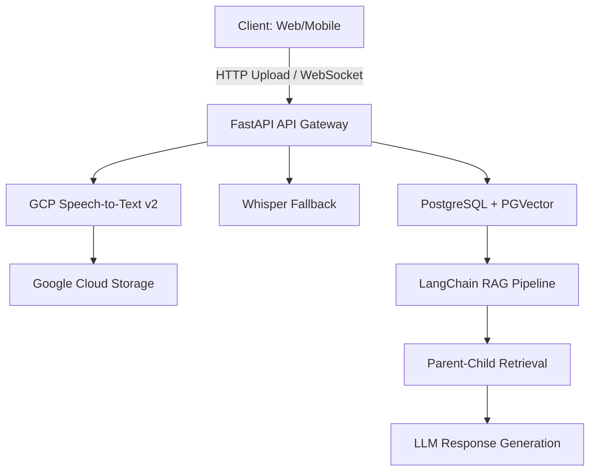

# 📑 Product Requirement Document (PRD)
## CourtSight — Fitur Speech-to-Text (STT) dengan GCP, LangChain, Whisper & FastAPI

**Versi:** 1.0.0  
**Tanggal:** September 16, 2025  
**Penulis:** CourtSight Development Team  
**Status:** Ready for Implementation

---

## 1. Pendahuluan

### 1.1 Tujuan Proyek
Fitur Speech-to-Text (STT) CourtSight bertujuan untuk:

- **Transkripsi Otomatis**: Mengubah rekaman audio sidang pengadilan, notulensi advokat, dan materi hukum menjadi teks yang akurat untuk integrasi dengan sistem RAG CourtSight
- **Dukungan Multi-Bahasa**: Fokus pada Bahasa Indonesia dengan dukungan bahasa hukum teknis
- **Integrasi RAG**: Transkrip langsung terintegrasi ke pipeline retrieval CourtSight untuk pencarian dan analisis hukum
- **Produksi-Ready**: Menggunakan Google Cloud Platform sebagai backbone untuk skalabilitas, keandalan, dan keamanan (STTv2) 

### 1.2 Ruang Lingkup Proyek
**In-Scope:**
- Batch transcription dari file audio (GCS dan upload langsung)
- Streaming STT untuk real-time transcription
- Diarization (pemisahan pembicara) dengan timestamps
- Integrasi dengan LangChain untuk pipeline RAG CourtSight
- Output format: JSON, SRT, VTT
- API endpoints FastAPI dengan dokumentasi OpenAPI

**Out-of-Scope (Fase 1):**
- Terjemahan otomatis bahasa
- PII redaction otomatis
- Video processing (hanya audio)

### 1.3 Target Audiens
- **Advokat & Hakim**: Transkripsi sidang real-time dan notulensi
- **Mahasiswa Hukum**: Transkrip kuliah dan ceramah hukum
- **Researcher**: Analisis materi hukum audio
- **CourtSight Users**: Integrasi dengan search engine untuk query multimodal

---

## 2. Deskripsi Keseluruhan

### 2.1 Konteks & Perspektif Produk
CourtSight STT melengkapi ekosistem RAG CourtSight dengan kemampuan multimodal. Sistem ini terintegrasi dengan:
- **Parent-Child Retrieval**: Transkrip diproses dengan chunking hierarkis (400 char child, 2000 char parent)
- **PGVector Database**: Embeddings disimpan di PostgreSQL dengan pgvector
- **Multi-Strategy Retrieval**: Mendukung vector_search, parent_child

### 2.2 Arsitektur Sistem


### 2.3 Fitur Utama
- **Batch STT**: Upload file audio → transkrip + embeddings → searchable di CourtSight
- **Streaming STT**: Real-time transcription dengan WebSocket
- **Diarization**: Identifikasi pembicara otomatis
- **RAG Integration**: Transkrip langsung masuk ke retrieval system
- **Multi-Format Output**: JSON untuk API, SRT/VTT untuk media

---

## 3. Kebutuhan Fungsional

### 3.1 FR-1: Batch Transcription API
**Endpoint:** `POST /api/v1/stt/transcribe`

**Input:**
```json
{
  "audio_uri": "gs://courtsight-stt/audio.wav",
  "language_code": "id-ID",
  "enable_diarization": true,
  "min_speakers": 2,
  "max_speakers": 6,
  "enable_word_time_offsets": true,
  "engine": "gcp_stt_v2",
  "output_format": "json"
}
```

**Process:**
1. Validasi input dan upload ke GCS jika perlu
2. Panggil GCP Speech-to-Text v2 API
3. Parse hasil dengan diarization dan timestamps
4. Simpan ke PostgreSQL dengan embeddings via PGVector
5. Return structured response

**Output:**
```json
{
  "job_id": "stt_12345",
  "transcript": "Full text transcript...",
  "segments": [
    {
      "speaker": "Speaker_1",
      "start_time": 0.0,
      "end_time": 5.2,
      "text": "Transcript segment..."
    }
  ],
  "words": [...],
  "storage_url": "gs://courtsight-stt/transcripts/stt_12345.json",
  "execution_time": 2.5
}
```

### 3.2 FR-2: Streaming Transcription
**Endpoint:** `WebSocket /api/v1/stt/stream`

**Features:**
- Real-time partial results
- Diarization on-the-fly
- Integration dengan CourtSight chat interface

### 3.3 FR-3: LangChain Integration
```python
# Integration dengan existing retrieval system
from langchain_google_community import SpeechToTextLoader
from src.app.services.retrieval.parent_child import ParentChildRetriever

# Load transcript sebagai Document
loader = SpeechToTextLoader(
    audio="gs://bucket/audio.wav",
    language_code="id-ID",
    enable_diarization=True
)
docs = loader.load()

# Process dengan Parent-Child Retriever
retriever = ParentChildRetriever(
    vector_store=pgvector_store,
    embeddings_model=embeddings,
    child_chunk_size=400,
    parent_chunk_size=2000
)
retriever.add_documents(docs)
```


## 4. Kebutuhan Non-Fungsional

### 4.1 Kinerja
- **Batch Processing**: p95 < 15 detik untuk 30 menit audio
- **Streaming Latency**: First partial < 800ms, refresh < 300ms
- **Accuracy**: WER ≤ 12% untuk Bahasa Indonesia legal context
- **Throughput**: 100 concurrent transcriptions

### 4.2 Keamanan & Privasi
- **IAM**: Service Account dengan minimal permissions
- **Encryption**: TLS 1.3, GCS encryption at-rest
- **Compliance**: Sesuai UU PDP Indonesia
- **Audit Logging**: Semua transaksi dicatat

### 4.3 Skalabilitas
- **Cloud Run**: Auto-scaling berdasarkan CPU/QPS
- **GCS**: Unlimited storage untuk audio files
- **PostgreSQL**: Connection pooling dengan SQLAlchemy

### 4.4 Ketersediaan
- **SLA**: 99.5% uptime
- **Backup**: Daily GCS backups
- **DR**: Multi-region deployment

---

## 5. Arsitektur Teknis

### 5.1 Komponen Inti

#### FastAPI Service Layer
```
src/app/api/routes/stt.py          # STT API endpoints
src/app/services/stt/               # Business logic
├── gcp_stt_service.py             # GCP STT integration
├── whisper_service.py             # Whisper fallback
└── transcription_processor.py     # Post-processing
```

#### Database Schema
```sql
-- STT Jobs Table
CREATE TABLE stt_jobs (
    job_id VARCHAR PRIMARY KEY,
    source_uri VARCHAR,
    engine VARCHAR,
    language_code VARCHAR,
    status VARCHAR,
    created_at TIMESTAMP,
    completed_at TIMESTAMP,
    transcript TEXT,
    metadata JSONB
);

-- Integration dengan existing chunks
ALTER TABLE document_chunks 
ADD COLUMN source_type VARCHAR DEFAULT 'text',
ADD COLUMN stt_job_id VARCHAR REFERENCES stt_jobs(job_id);
```

#### Configuration
```python
# src/app/core/config.py
class STTConfig:
    GCP_PROJECT = "courtsight-prod"
    STT_ENGINE = "gcp_stt_v2"  # or "whisper"
    WHISPER_MODEL = "large-v3"
    LANGUAGE_CODE = "id-ID"
```

### 5.2 Dependencies
```toml
# pyproject.toml additions
dependencies = [
    "google-cloud-speech>=2.0.0",
    "google-cloud-storage>=2.0.0", 
    "langchain-google-community>=0.3.0",
    "openai-whisper>=20240930",
    "faster-whisper>=1.0.0",
    "websockets>=12.0",
    "pydub>=0.25.0",  # Audio processing
]
```

---

## 6. API Kontrak (OpenAPI)

### 6.1 Batch Transcription
```yaml
openapi: 3.0.0
paths:
  /api/v1/stt/transcribe:
    post:
      summary: Batch audio transcription
      requestBody:
        required: true
        content:
          application/json:
            schema:
              $ref: '#/components/schemas/STTRequest'
      responses:
        '200':
          description: Transcription completed
          content:
            application/json:
              schema:
                $ref: '#/components/schemas/STTResponse'
        '202':
          description: Transcription in progress
          content:
            application/json:
              schema:
                $ref: '#/components/schemas/STTJobStatus'
```

### 6.2 Pydantic Models
```python
# src/app/schemas/stt.py
class STTRequest(BaseModel):
    audio_uri: str = Field(..., description="GCS URI or upload URL")
    language_code: str = "id-ID"
    enable_diarization: bool = True
    min_speakers: int = Field(1, ge=1, le=10)
    max_speakers: int = Field(6, ge=1, le=10)
    enable_word_time_offsets: bool = True
    engine: STTEngine = STTEngine.GCP_STT_V2
    output_format: OutputFormat = OutputFormat.JSON

class STTResponse(BaseModel):
    job_id: str
    transcript: str
    segments: List[TranscriptSegment]
    words: List[WordTimestamp]
    storage_url: Optional[str]
    execution_time: float
    confidence: float
```

---

## 7. Implementasi & Deployment

### 7.1 Development Setup
```bash
# Install dependencies
pip install -e ".[dev]"

# Set environment variables
export GCP_PROJECT=courtsight-prod
export GOOGLE_APPLICATION_CREDENTIALS=/path/to/service-account.json

# Run locally
uvicorn src.app.main:app --reload
```

### 7.2 Docker Deployment
```dockerfile
# Dockerfile additions
FROM python:3.11-slim

# Install system dependencies for Whisper
RUN apt-get update && apt-get install -y ffmpeg

# Copy and install Python dependencies
COPY pyproject.toml .
RUN pip install -e .

# Expose ports
EXPOSE 8000

# Run with gunicorn
CMD ["gunicorn", "src.app.main:app", "-w", "4", "-k", "uvicorn.workers.UvicornWorker"]
```

### 7.3 Cloud Run Deployment
```yaml
# cloud-run.yaml
apiVersion: serving.knative.dev/v1
kind: Service
metadata:
  name: courtsight-stt
spec:
  template:
    spec:
      containers:
      - image: gcr.io/courtsight-prod/courtsight-stt:latest
        env:
        - name: GCP_PROJECT
          value: "courtsight-prod"
        resources:
          limits:
            cpu: "2000m"
            memory: "4Gi"
```

---

## 8. Testing & QA

### 8.1 Unit Tests
```python
# tests/test_stt.py
def test_batch_transcription():
    # Test GCP STT integration
    pass

def test_diarization():
    # Test speaker separation
    pass
```

### 8.2 Integration Tests
```python
# Test dengan existing RAG system
def test_stt_rag_integration():
    # Upload audio → transcribe → search → verify results
    pass
```

### 8.3 Performance Benchmarks
- **Dataset**: 100 jam rekaman sidang pengadilan
- **Metrics**: WER, CER, Latency, DER (Diarization Error Rate)
- **Target**: WER < 12%, Latency < 15s p95

---

## 9. Risiko & Mitigasi

### 9.1 Technical Risks
| Risiko | Probabilitas | Dampak | Mitigasi |
|--------|-------------|--------|----------|
| GCP Quota Exceeded | Medium | High | Auto-fallback ke Whisper + monitoring |
| Whisper Hallucination | Low | Medium | Confidence thresholding + post-validation |
| Audio Quality Issues | Medium | Medium | Pre-processing dengan pydub |

### 9.2 Business Risks
| Risiko | Probabilitas | Dampak | Mitigasi |
|--------|-------------|--------|----------|
| Cost Overrun | Medium | High | Quota monitoring + cost optimization |
| Accuracy Issues | Low | High | Human validation pipeline |

---

## 10. Timeline & Milestones

### Phase 1: Core Implementation (4 weeks)
- [ ] GCP STT integration
- [ ] Basic API endpoints
- [ ] Database schema updates
- [ ] Unit tests

### Phase 2: Advanced Features (3 weeks)
- [ ] Streaming STT
- [ ] Diarization optimization
- [ ] Whisper fallback
- [ ] LangChain integration

### Phase 3: Production & Testing (2 weeks)
- [ ] Performance testing
- [ ] Security audit
- [ ] Documentation
- [ ] Deployment to production

---

## 11. Referensi & Sumber Bacaan

### Google Cloud Platform
- [Speech-to-Text V2 Documentation](https://cloud.google.com/speech-to-text/docs)
- [Diarization Guide](https://cloud.google.com/speech-to-text/docs/diarization)
- [Streaming Speech Recognition](https://cloud.google.com/speech-to-text/docs/streaming)
- [Cloud Storage Best Practices](https://cloud.google.com/storage/docs/best-practices)

### LangChain Integration
- [Google Speech-to-Text Loader](https://python.langchain.com/docs/integrations/document_loaders/google_speech_to_text)
- [LangChain Document Loaders](https://python.langchain.com/docs/modules/data_connection/document_loaders/)

### Whisper & OpenAI
- [Whisper GitHub Repository](https://github.com/openai/whisper)
- [Faster Whisper](https://github.com/SYSTRAN/faster-whisper)
- [Whisper Performance Tuning](https://github.com/openai/whisper/discussions/735)

### FastAPI & Python
- [FastAPI Documentation](https://fastapi.tiangolo.com/)
- [WebSocket Support](https://fastapi.tiangolo.com/advanced/websockets/)
- [Pydantic Models](https://docs.pydantic.dev/)

### Audio Processing
- [PyDub Documentation](https://pydub.com/)
- [FFmpeg Integration](https://ffmpeg.org/)

---

## 12. Lampiran

### 12.1 Environment Variables
```bash
# .env
GCP_PROJECT=courtsight-prod
GCS_BUCKET=courtsight-stt
STT_ENGINE=gcp_stt_v2
WHISPER_MODEL=large-v3
LANGUAGE_CODE=id-ID
MAX_CONCURRENT_JOBS=10
AUDIO_MAX_SIZE_MB=100
```

### 12.2 Sample API Usage
```python
import requests

# Batch transcription
response = requests.post(
    "http://localhost:8000/api/v1/stt/transcribe",
    json={
        "audio_uri": "gs://courtsight-stt/sample.wav",
        "language_code": "id-ID",
        "enable_diarization": True
    }
)

result = response.json()
print(f"Transcript: {result['transcript']}")
```

### 12.3 Cost Estimation
- **GCP Speech-to-Text**: $0.006/minute (standard)
- **Cloud Storage**: $0.026/GB/month
- **Cloud Run**: $0.000024/vCPU-second
- **PostgreSQL**: Existing infrastructure

---

**Dokumen ini akan diperbarui seiring perkembangan implementasi. Pastikan untuk mereview dan approve sebelum memulai development.**

*CourtSight Development Team*  
*September 16, 2025*</content>
<parameter name="filePath">/mnt/2A28ACA028AC6C8F/Programming/webdevoloper/fastapi/coursigh/docs/projects_plan/PRD_STT_Updated.md
</parameter>